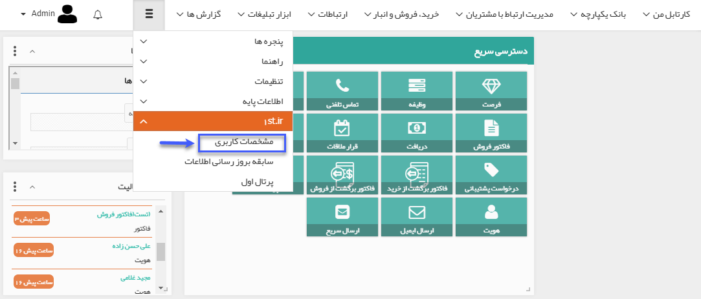
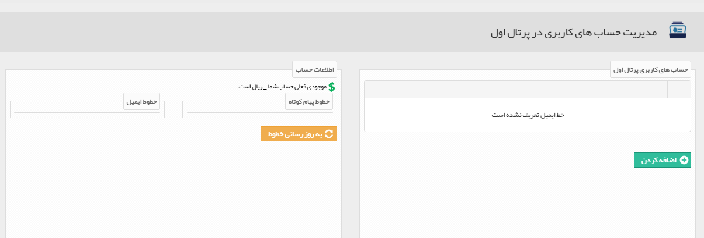
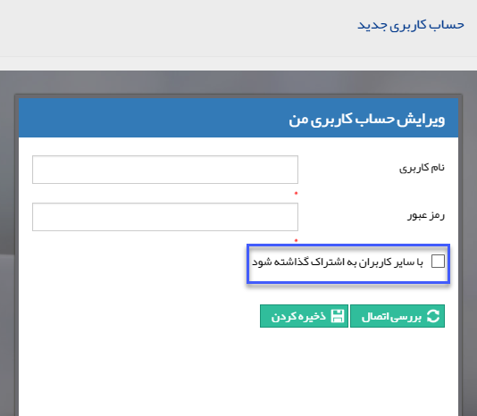
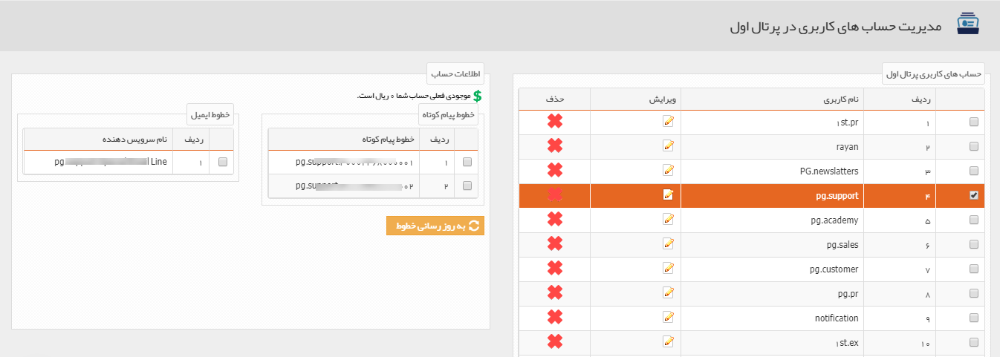

# 1st.ir    

**مشخصات کاربری**

[**تجارت اول**](https://1st.ir/) به عنوان یکی از اعضای مجموعه شرکت های تجارت الکترونیک اول، با هدف ایجاد بازار معاملات کشوری، تسهیل فرایند تجارت الکترونیک برای تمامی تامین کنندگان و خریداران ایرانی و از میان برداشتن محدودیت های مالی در این حوزه در سال 1389 تاسیس گردید.

مجموعه بزرگ و پراکنده خریداران و فروشندگان موجود در ایران، تشخیص کسب و کار معتبر برای شکل گیری ارتباط و انجام معاملات را تا حدودی دشوار نموده است. در این راستا تجارت اول، با رویکرد رفع کاستی های موجود در **خرید و فروش عمده**، بستر مناسبی شامل اعطای صفحات اختصاصی، فروشگاه آنلاین، درگاه پرداخت امن و ... را جهت کسب و کار در فضای تجارت الکترونیک ایجاد نموده است.

در حال حاضر تجارت اول به عنوان بزرگترین سامانه تجارت بین بنگاهی (B2B) در ایران با بیش از دویست هزار کسب و کار از سراسر کشور در حوزه تجارت الکترونیک در حال فعالیت می باشد .

برای ارتباط با تجارت اول باید دارای یک حساب کاربری در تجارت اول [**(www.1st.ir)**](http://www.1st.ir) باشید پس از ثبت نام در سایت می توانید از طریق منوی بالای صفحه پیام گستر، **1st.ir** را باز کنید و مشخصات کاربری خود را وارد نمایید و از برقراری اتصال اطمینان حاصل نمایید.( [راهنمای ثبت نام در سایت](HelpPayamgostar\PreparationChargeAndUsernameOfThePortal\PreparationUsername.md) )

 

برای اضافه کردن یک نام کاربری، دکمه اضافه کردن را کلیک کنید، پنجره زیر نمایش داده می شود و شما می توانید نام کاربری و رمز عبوری که در تجارت اول ایجاد کرده اید، را وارد کردهسپس با زدن دکمه بررسی اتصال در صورتی که اتصال به دسترسی برقرار شود پیامی مبنی بر موفقیت آمیز بودن نمایش داده می شود و شما با زدن دکمه ذخیره کردن، نام کاربری را ثبت می نمایید. می توانید خطوط پیامک و خط ایمیل حساب کاربری خود را با استفاده از چک باکس "با سایر کاربران به اشتراک گذاشته شود" به اشتراک بگذارید.

بعد از ثبت می توانید آن ها را ویرایش و یا حذف نمایید. پس از ساخت نام کاربری، به روز رسانی خطوط را بزنید تا خطهای پیام کوتاه و ایمیلی که به نام کاربری شما اختصاص داده شده و همچنین موجودی شما نمایش داده می شود . ([راهنمای شارژ حساب کاربری](1st/PreparationInitialCharge.md))

