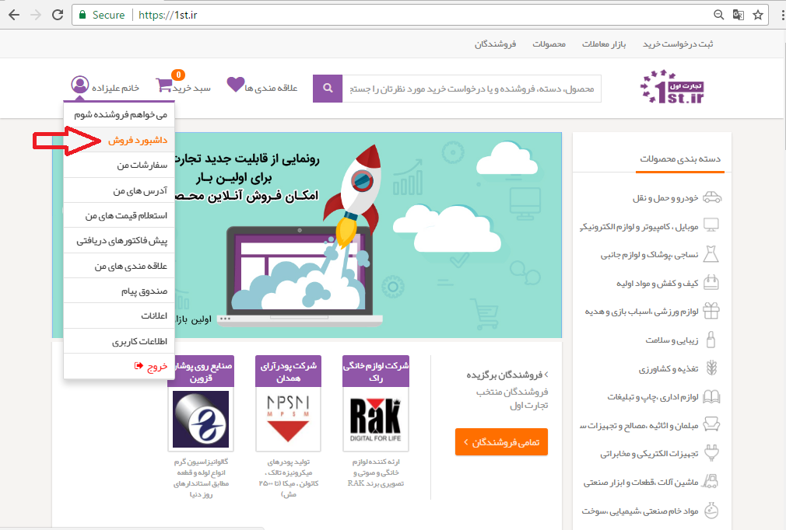
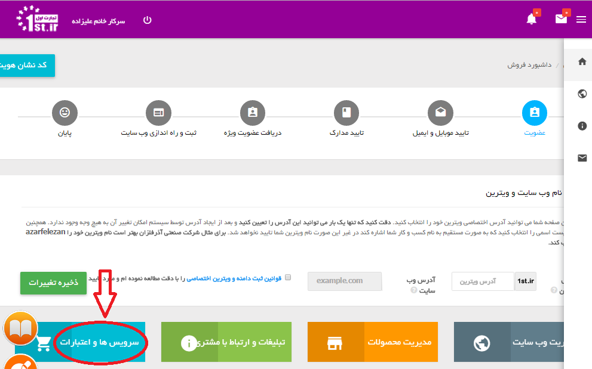
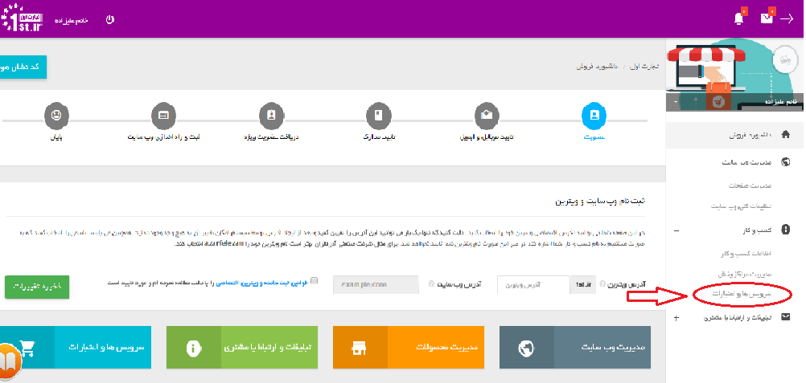
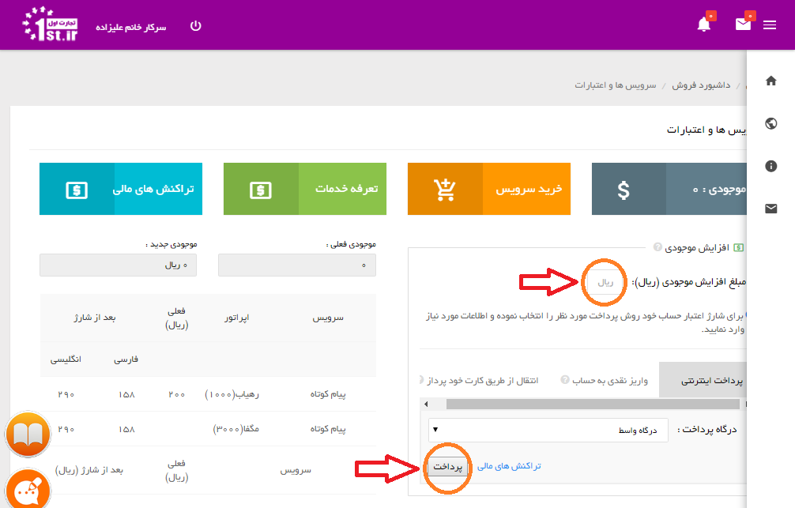
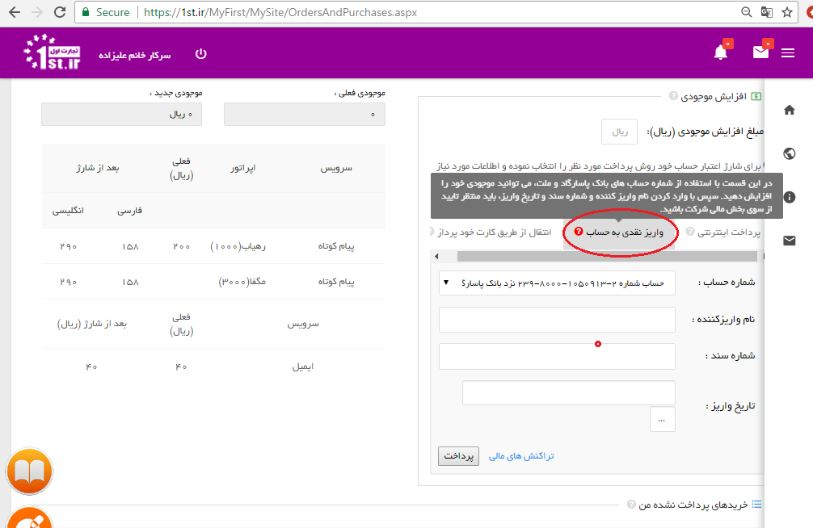
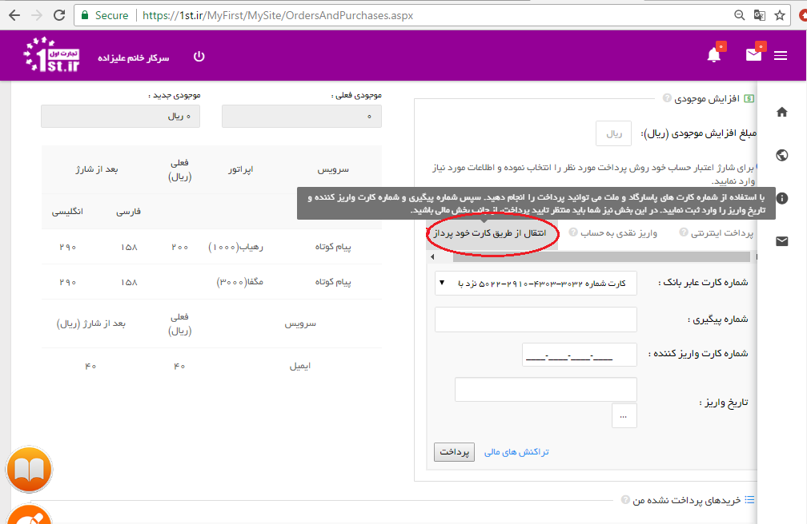

# نحوه شارژ موجودی تجارت اول    

نحوه شارژ موجودی تجارت اول

برای شارژ موجودی حساب تجارت اول خود مراحل زیر را طی کنید:

پس از ورود به سایت تجارت اول بر روی داشبورد فروش کلیک نمایید.

از دو قسمت زیر می توان به "سرویس ها و اعتبارات" دسترسی پیدا کرد.

در  این  قسمت با توجه به نحوه پرداخت، یکی از سه گزینه "پرداخت اینترنتی" ، "واریز نقدی به حساب" و " انتقال از طریق کارت خودپرداز" که به ترتیب در تصاویر زیر آمده است انتخاب نموده و پرداخت را انجام دهید.

چنانچه  پرداخت  اینترنتی  باشد، کافیست مبلغ  را  در  کادر  مربوطه  وارد نمایید و کلید پرداخت را بزنید تا به درگاه پرداخت اینترنتی متصل شوید.

در صورت انتخاب «واریز نقدی به حساب» نام واریز کننده را وارد کنید و شماره سندی که در فیش واریزی درج شده را به همراه تاریخ واریز آن  ثبت کنید، سپس کلید پرداخت را بزنید.

آخرین نحوه پرداخت «انتقال از طریق کارت خودپرداز» شماره پیگیری انتقال وجه را به همراه شماره کارتی که از آن وجه را منتقل نموده اید و تاریخ پرداخت  آن ثبت کرده و کلید پرداخت را بزنید.

در صورت پرداخت از طریق هر یک از روش های « واریز نقدی به حساب» و «انتقال از طریق کارت خودپرداز» نیاز به تائیدیه واحد مالی می باشد، پرداخت های صورت گرفته ظرف مدت 24 ساعت از زمان ثبت واریزی در سیستم تائید خواهند شد.