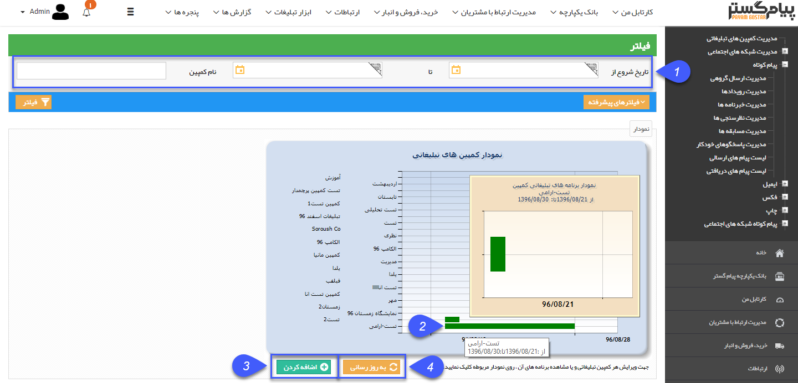
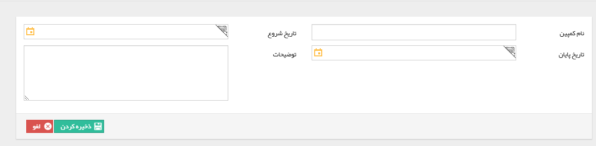
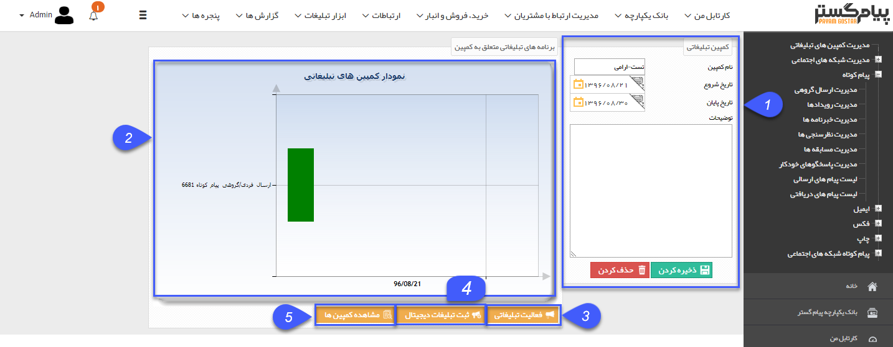
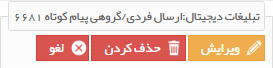
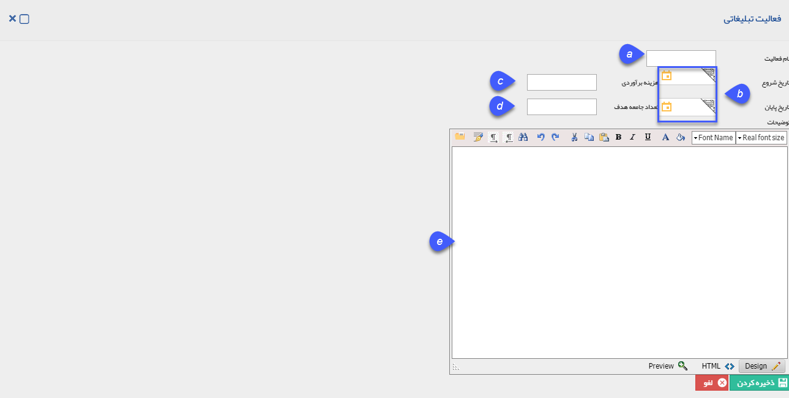
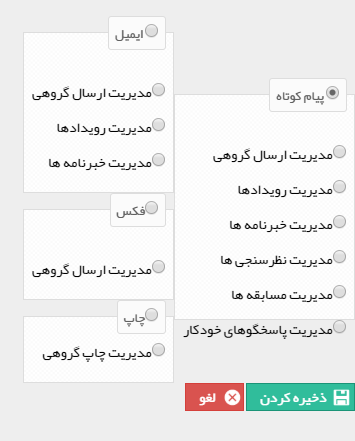
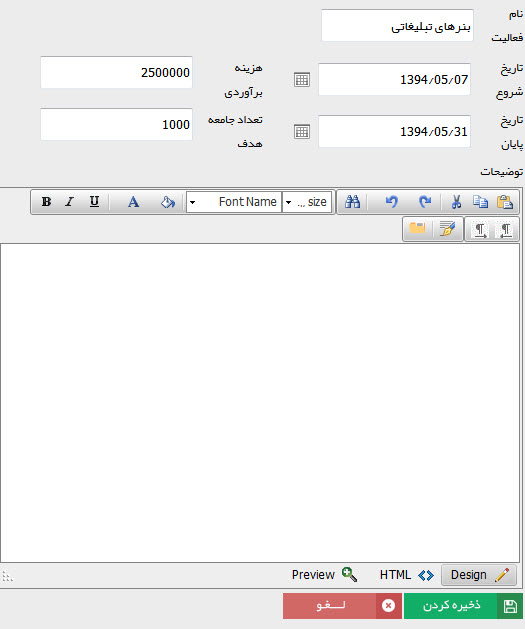

# مدیریت کمپین های تبلیغاتی    

**مدیریت یکپارچه تبلیغاتی (کمپین)**

=======================================

**

**به مجموع هرچیزی در راستای رسیدن به هدفی مشخص کمپین گفته می شود، مانند کمپین مردمی که نشان دهنده اجتماع مردم برای هدف خاصی است. کمپین های تبلیغاتی مجموعه ای تبلیغات دیجیتال و غیر دیجیتال هستند که در راستای تبلیغ ونمایش محصول و یا خدمت خاصی استفاده می شوند.**

** کمپین تبلیغاتی برای مدیریت بهتر برنامه های تبلیغاتی اجرا شده و بررسی بهتر نتایج این برنامه ها در نظر گرفته شده است. می توان در این قسمت تمام کمپین هایی که اجرا شده و یا در حال اجرا هستند را مدیریت نمود و بر اساس تاریخ ثبت و یا نوع رسانه  فیلتر نمود. تمام اطلاعات مربوط به کمپین را از قبیل اطلاعات رویداد، میزان اجرای کمپین و نمودارهای آن را مشاهده نمود و از نتایج این کمپین به طورکامل آگاه شد.**

** **

**1.تاریخ شروع از/تا:** در این قسمت می توان بازه زمانی ویا نام کمپین مورد نظر جهت مشاهده و بررسی را  فیلتر کرد.

****2.نمودار:** با نگه داشتن نشانگر موس، می توانید مشخصات کمپین مانند تاریخ شروع و پایان را مشاهده نمایید و در صورت کلیک بر روی کمپین مورد نظر در نمودار، وارد تنظیمات آن کمپین خواهید شد.**

**3.اضافه کردن:**با کلیک بر روی دکمه اضافه کردن پنجره زیر برای شما باز خواهد شد و می توانید کمپین تبلیغاتی و بازه اجرای آن را مشخص نمایید.

**4.به روز رسانی:** این دکمه در راستای به روز رسانی تاریخ کمپین ها تعبیه شده است.

** **

**نکته: طبق عکس بالا، با نوشتن نام کمپین و تاریخ شروع و پایان، می توانید یک کمپین تعریف نمایید. فیلد توضیحات جهت شرح اطلاعات اولیه و مورد نیاز درباره کمپین تعبیه شده است.**

** **

**1\. اطلاعات :** در این قسمت، اطلاعات کمپین مانند تاریخ شروع و پایان و نام را مشاهده میکنید.

**2\. نمودار برنامه های تبلیغاتی:** برنامه های تبلیغاتی که برای این کمپین تعریف شده شده است بصورت بازه زمانی در این نمودار نمایش داده می شود. و با کلیک بر روی هرکدام، پنجره ای به شکل زیر جهت تدوین برای شما باز میگردد.

****

**3.فعالیت تبلیغاتی:** بازدن این دکمه وارد پنجره تعریف برنامه تبلیغاتی غیر دیجیتال خواهید شد.(منظور از غیر دیجیتال، برنامه های تبلیغاتی است که در پیام گستر انجام و ارسال نمی شوند.)

**a.نام فعالیت:** در این فیلد نام تبلیغات مورد نظر نوشته می شود.

**b.تاریخ شروع/پایان:** تاریخ شروع تبلیغ و تاریخ پایان در این فیلدها مشخص میگردد.

**c.هزینه برآورد:**هزینه ای که بابت تبلیغ داده می شود و یا برآورد می شود که باید داده شود را اینجا یادداشت می کنید.

**d.تعداد جامعه هدف:** تعداد مخاطبانی که انتظار می رود تبلیغ شمارا ببینند در این فیلد مشخص می شود.

**e.توضیحات:** توضیحات مرتبط با تبلیغ کمپین را در این قسمت بنویسید. (مانند نوع ابزار تبلیغ و نحوه کاربری و اجرای تبلیغ)

**4.ثبت تبلیغات دیجیتال:**

با کلیک بر روی این دکمه، امکان انتخاب یکی از روش های تبلیغات در نرم افزار مانند: پیامک، ایمیل، فکس و چاپ می باشد. پس از انتخاب وارد صفحه مدیریت  همان ابزار تبلیغاتی  جهت تنظیم ارسال(که در بخش [اطلاعات مشترک ابزار](ToolsSharedInformation.md) کامل توضیح داده شده) خواهیم شد.

**5.مشاهده کمپین ها:**

در این قسمت می توانید کمپین انتخاب شده را ویرایش نمایید. مطابق آموزش قبل.

** **

**