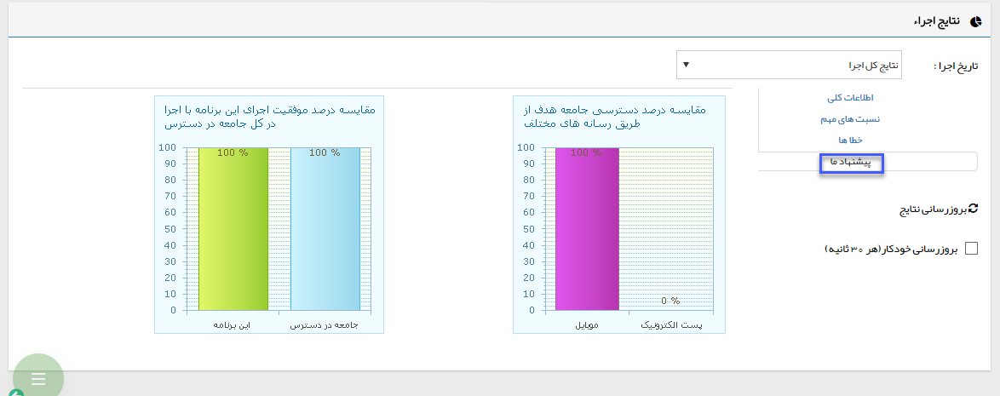
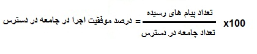

# پیشنهاد ما    

**د** **–** **پیشنهاد ما**

------------------------------

                                                      

**1)** **مقایسه درصد دسترسی به جامعه هدف از طریق رسانه های مختلف**

در این مقایسه، بررسی می شود که جامعه هدف بر اساس رسانه های مختلف موبایل، ایمیل و فکس تا چه حد در دسترس بوده و استفاده از کدام رسانه برای ارتباط با این بخش از مخاطبان احتمالی مناسب تر می باشد .

در برنامه ای که مثال زده ایم، مشاهده می شود که جامعه هدف از طریق سه رسانه پیام کوتاه، ایمیل و فکس قابل دسترسی می باشد. اما درصد دسترسی به این مخاطبان از ابزارهای مختلف، متفاوت از هم بوده و می تواند ملاک خوبی برای انتخاب رسانه تبلیغاتی باشد.

به کسی که قصد ارسال پیام تبلیغاتی برای این مخاطبان را دارد توصیه می کنیم از ابزار پیام کوتاه به جای ایمیل استفاده کند .

**2) مقایسه درصد موفقیت اجرای این برنامه با اجرا در کل جامعه در دسترس**

وقتی یک کاربر از میان جامعه در دسترس تعدادی را به عنوان مخاطب هدف انتخاب می کند، با محدود کردن مخاطبان برنامه تبلیغاتی، از اثربخشی آن برنامه می کاهد. در این نمودار، درصد موفقیت برنامه ی جاری نسبت به زمانی که تمام جامعه در دسترس به عنوان مخاطب هدف انتخاب شوند، مقایسه می شود .

طبیعتا هرچه تعداد مخاطبان هدف یک برنامه از جامعه در دسترس کمتر باشد، درصد موفقیت اجرای برنامه در کل جامعه در دسترس نسبت به حالت فعلی کمتر خواهد بود .

