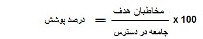
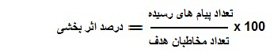

# نسبت های مهم    

ب- نسبت های مهم

                                                                

--------------------------------------------------------------------------------------------------------------------------

1) درصد پوشش= درصد پوشش برای تاکید بر انتخاب شما می باشد و نشان می دهد از تمام مخاطبانی که می توانستید در برنامه تبلیغاتی حاضر شرکت دهید و با رسانه مورد نظر برای آنها پیام ارسال کنید، چه حجمی را انتخاب کرده و در واقع پوشش تبلیغاتی داده اید. حاصل نسبت مخاطبان هدف (ستون 3) به جامعه در دسترس (ستون 2) نشان دهنده میزان مخاطبان پوشش داده شده در یک تبلیغ است.

> > > > > > > 
> > > > > > > 
> > > > > > > **2) درصد موفقیت = حاصل نسبت تعداد پیام های رسیده (ستون 5) به مخاطبان هدف انتخاب شده (ستون 3) نشان دهنده موفقیت ارسال پیام و تحویل به مخاطبان مورد نظر می باشد.**
> > > > > > > 
> > > > > > > 