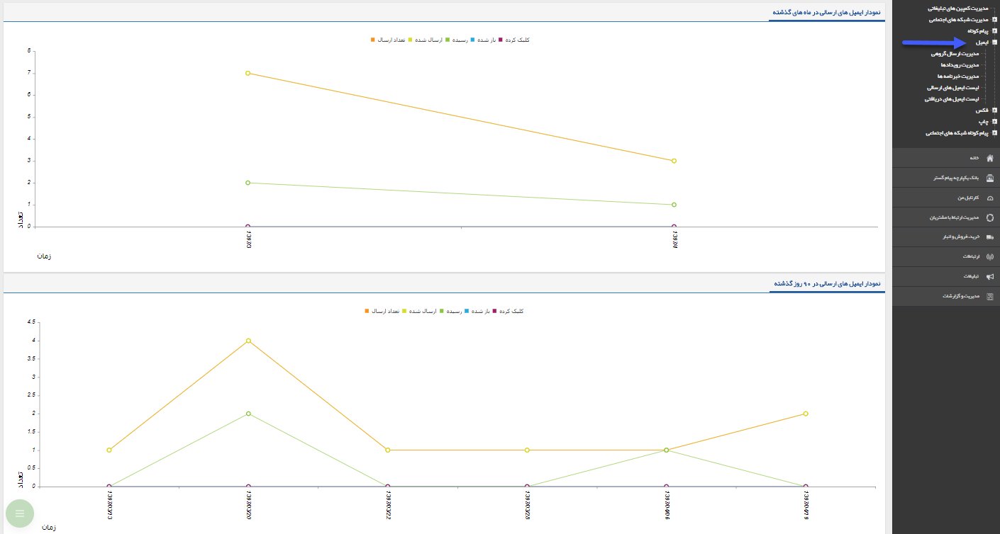

# ایمیل (Email)    

ایمیل

---------

> [اپراتور ارسال](Email/SendingOperator.md)
> 
> [فرستنده ایمیل](Email/Sender.md)
> 
> [ایمیل ویژه-هوشمند](Email/InteligentEmail.md)
> 
> [طریقه ایجاد یک ایمیل عکس دار](Email/CreateAnEmailWithImage.md)
> 
> [مدیریت ارسال گروه](Email/GroupSendingManagement.md)
> 
> [رویداد تبلیغاتی](Email/Advertisment.md)
> 
> [خبرنامه](Email/News.md)
> 
> [لیست ایمیل های ارسالی](Email/SendingEmailList.md)
> 
> [لیست ایمیل های دریافتی](Email/GettingEmailList.md)
> 
> 