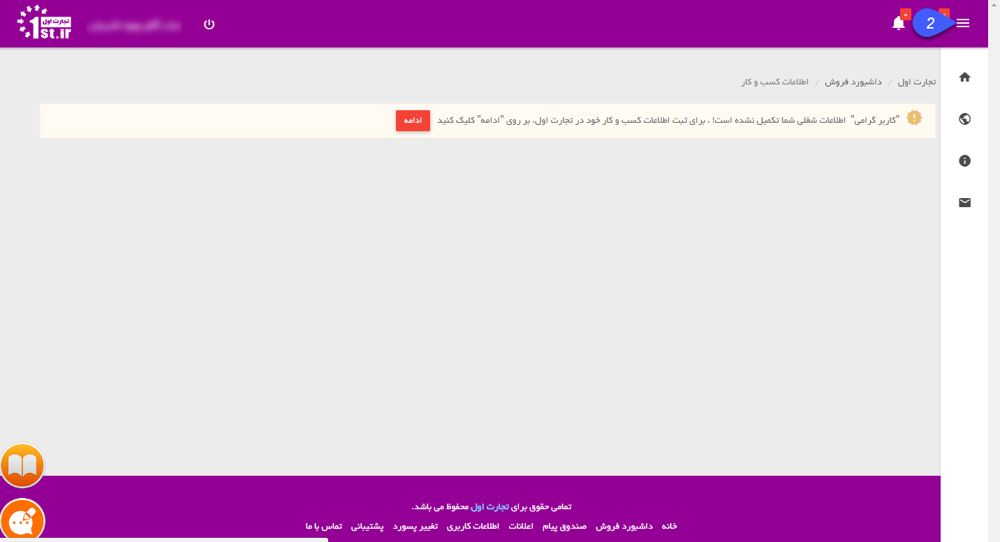
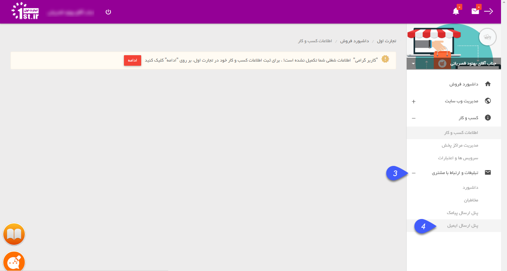
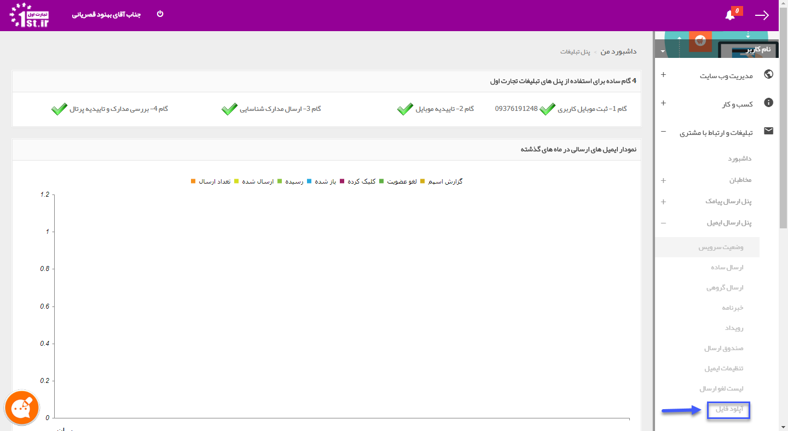
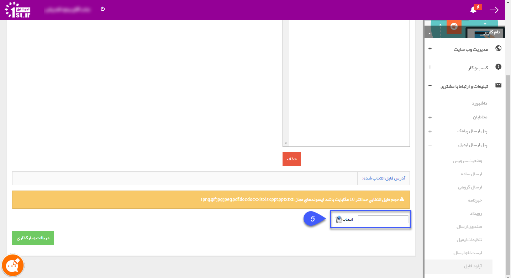

# طریقه ایجاد یک ایمیل عکس دار        

**طریقه ایجاد یک ایمیل عکس دار**

برای ایجاد یک ایمیل عکس دار که تصویر آن در داخل یک سایت آپلود شده باشد می توان آدرس آن فایل را می در داخل گام تنظیم متن مطابق تصویر وارد نمود. تنها از این طریق، تصویر موجود در متن، در ایمیل های مخاطبان مشاهده خواهد شد.

سایت  [www.1st.ir](http://www.1st.ir)  این فرصت را برای شما فراهم آورده است که تصاویر و فایل های موردنیاز را در داخل خود سایت آپلود نمایید .

**ابتدا می بایست به سایت** **[**پرتال اول**](http://www.1st.ir)** **مراجعه کرده و با نام کاربری خود ورود نمایید. همانطور که در تصویر مشاهده می نمایید به مسیر داشبورد من ---> پنل ایمیل ---> بانک فایل های من مراجعه نمایید** **.** 

**1\. ابتدا در سایت پرتال اول به قسمت داشبورد من مراجعه کنید. و برروی دکمه "می خواهم فروشنده شوم" کلیک نمایید.**

****

**2. بر روی تب سه خط کلیک کنید تا وارد منوی پرتال شوید.**

****

**3و 4. بر روی تبلیغات و ارتباط با مشتری و سپس بر روی پنل ارسال ایمیل کنید.**

****

**5\. عکس مورد نظر را انتخاب کنید. مطابق با شکل انتخاب کنید.**

****

****

**6\. با کلیک بر روی این دکمه فایل را بر روی سایت بارگزاری کنید.**

**7\. لینک مورد نظر را کپی کنید.**

  

هنگام اجرای برنامه ایمیل گروهی، در گام محتوای پیام بر روی آیکون **"** **InsertImage****"**  کلیک می نماییم و در پنجره جدید آدرس موردنظر را در کادر **"ImageSrc"**  وارد می نماییم.

