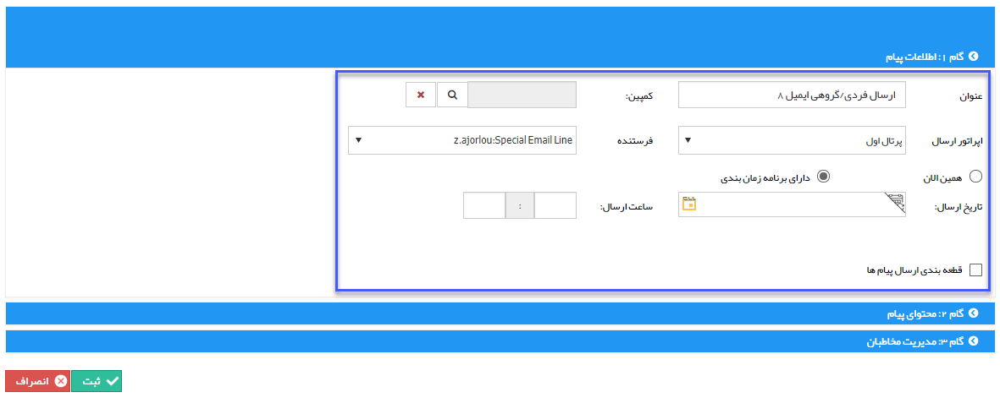

# گام 1- اطلاعات اولیه ارسال گروهی    

  **گام 1- اطلاعات اولیه ارسال گروهی**

به بخش [گام اول - اطلاعات پیام](../../ToolsSharedInformation/Step1messageinfo.md) در اطلاعات مشترک ابزارها مراجعه کنید.

این مخاطبان باید شامل پروفایل هایی باشند که آدرس ایمیل در آن ها وجود داشته باشد .

