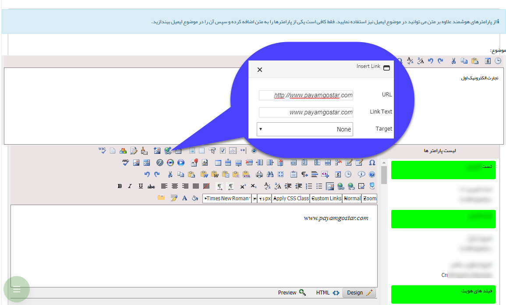

# ایمیل ویژه-هوشمند        

ایمیل ویژه (هوشمند)
-------------------

ایمیل ویژه برای دنبال کردن عکس العمل مخاطب شماست. آگاهی از جذابیت و تاثیر پیام شما بر مخاطب می تواند در بهبود تبلیغات شما تاثیر بسزایی داشته  باشد. با انتخاب این اپراتور ارسال ها دارای تضمین Inbox هستند و پس از ارسال موفق یا ناموفق بودن ارسال و همچنین باز شدن و یا نشدن ایمیل توسط مخاطب را به کاربر نمایش می دهد .

همچنین شما می توانید یک لینک را به صورتی  تنظیم کنید و به همراه متن دلخواه خود ارسال کنید تا در قسمت [تحلیل کمپین](../AdvertismentManagement.md) بتوانید تعداد کسانی که این ایمیل را باز می کنند و همچنین کسانی که پس از دیدن متن شما بر روی این لینک (لینک ویژه) کلیک کرده اند، مشاهده کنید.

نکته جالب توجه در ارسال ایمیل ویژه، قراردادن لینک ویژه است. می توان در قسمت تنظیم متن لینکی قرارداد و با کلیک راست بر روی آن و انتخاب لینک ویژه، این لینک را قابل ردگیری کرد. به این شکل که اگر دریافت کننده ایمیل بر روی لینک کلیک نمایید در نمودار در ستون مخاطبان بازخورده نمایش داده می شود.

نکته: در صورتی که می خواهید از SMTP  برای ارسال ایمیل استفاده نمایید ایمیل شما قابلیت ردگیری نخواهد داشت و می توانید در قسمت روش ارسال، اطلاعات سرویس دهنده موردنظر خود را وارد نمایید.

 

1\. پس از انتخاب متن مورد نظر جهت تعقیب(track)، باکلیک بر روی این آیکونپنجره وارد کردن Hyperlink باز میشود.

2\. آدرس url دلخواه (برای مثال آدرس سایت خود) را در این قسمت وارد کنید.