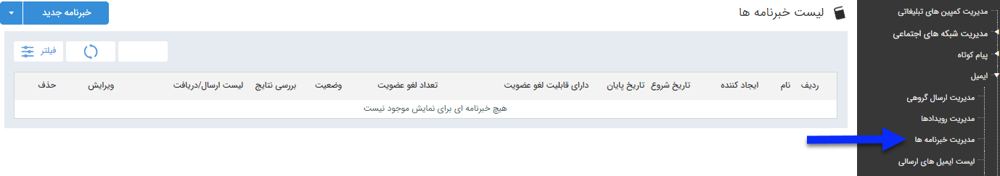

# خبرنامه      ** 

### خبرنامه

**برای ارسال پیام های هوشمند مختلف در زمان های مختلف با قابلیت عضویت و لغو عضویت برای مخاطبان از خبرنامه استفاده کنید. در صفحه اول، می توان با تعیین تاریخ اجرا و زدن دکمه فیلتر، لیست برنامه های اجرا شده در گذشته را مشاهده کرد. اما برای اجرای یک برنامه جدید باید بر روی دکمه "خبرنامه جدید" در سمت راست و بالای صفحه کلیک کرده و با گذراندن چند گام ساده، برنامه را به راحتی اجرا کرد.**

**

لطفا ابتدا [اطلاعات مشترک ابزارها](../ToolsSharedInformation.md) را مطالعه فرمایید و طبق گام های زیر برای ارسال گروهی جدید اقدام فرمایید

****

### **

[گام1-اطلاعات اولیه خبرنامه](News/Step1.md)

[گام2- محتوای خبرنامه](News/Step2.md)

[گام3-انتخاب مخاطبان](News/Step3.md)

**

****