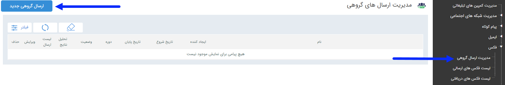

# مدیریت ارسال گروهی    

### مدیریت ارسال گروهی

**در صفحه اول، می توان با تعیین تاریخ اجرا و زدن دکمه فیلتر، لیست برنامه های اجرا شده در گذشته را مشاهده کرد. اما برای اجرای یک برنامه جدید باید بر روی دکمه "ارسال گروهی جدید" در سمت راست و بالای صفحه کلیک کرده و با گذراندن چند گام ساده، برنامه را به راحتی اجرا کرد .**

**

**[گام1-اطلاعات اولیه ارسال گروهی](GroupSendingList/Step1.md)**

**[گام2-تنظیم متن](GroupSendingList/Step2.md)**

**[گام3-انتخاب مخاطبان](GroupSendingList/Step3.md)**

**

