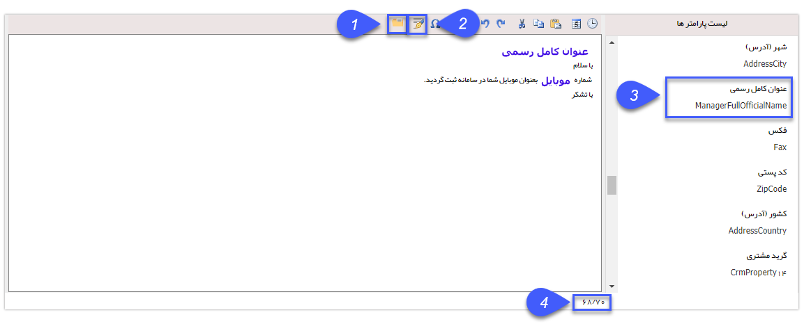

# متن هوشمند    

**متن هوشمند**

------------------

برای اینکه هرکدام از مخاطبان شما مشخصات دقیق خودش را در متن ارسالی شما ببیند و اثربخشی و اعتماد به پیام شما بیشتر شود، از متن هوشمند استفاده کنید. در جای خالی، متن خود را بنویسید و هر جا که نیاز به استفاده از مشخصات مخاطب خود دارید، از ستون سمت راست روی هر مورد که لازم می دانید، دوبار کلیک کنید تا در متن شما وارد شده و پس از اجرای برنامه با محتوای منطبق با هر مخاطب برای وی ارسال شود.

برای مثال در شکل زیر متنی که مخاطبان پیام دریافت می کنند به جای پارامتر "عنوان کامل رسمی" آنچه دریافت می کنند " جناب آقای+نام+نام خانوادگی" و در صورت مونث بودن مخاطب" سرکار خانم+نام+نام خانوادگی" است.

**1\. انتخاب از قالب ها:** با کلیک بر روی آیکون فولدر در نوار ابزار متن می توانید از قالب های تعیین شده ی قبلی استفاده کرده و با متنی را از یک فایل در ج نمایید. ( [انتخاب قالب پیام](ToolsSharedInformation/Step2messagecontent/TemplateSelection.md))

**2. ****درج امضاء:** با کلیک بر روی آیکون قلم می توانید امضای جدیدی را ایجاد کنید و یا از امضاهایی که قبلا برای خود ایجاد نموده اید استفاده کنید. ([اضافه کردن امضا](ToolsSharedInformation/Step2messagecontent/Sign.md) ) 

**3\. انتخاب از لیست پارامترها:** جهت استفاده از پارامترهای هوشمند در متن خودکافی است روی آن ها دوبار کلیک نمایید.

**4.تعداد حرف/پیامک:** در این قسمت شما تعداد حرف ها و پیامک های متن خود را می توانید ببینید.