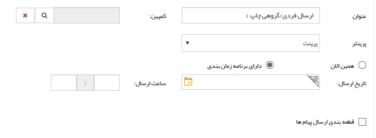

# گام 1- اطلاعات اولیه چاپ گروهی      **

**گام 1- اطلاعات اولیه**

**

**به [گام اول - اطلاعات پیام](../../ToolsSharedInformation/Step1messageinfo.md) در اطلاعات مشترک ابزارها مراجعه کنید**

**

**

چاپ به دو صورت امکان پذیر است. چاپ صفحه ای و چاپ چندتایی در یک صفحه.

نکته: برای تنظیمات چاپ چند تایی به قسمت [پرینتر](../../../Setting/TotalSetting/Printer.md) در [تنظیمات کلی](../../../Setting/TotalSetting.md) مراجعه کنید.

از چاپ چندتایی در یک صفحه، برای مواردی مانند چاپ lable استفاده می شود. برای تنظیمات این نوع چاپ باید پرینتری به صورت جداگانه تعریف شود. با انتخاب دکمه اضافه کردن، پنجره کوچکی نمایش داده می شود برای تعریف چاپگر. عنوانی برای چاپگر انتخاب و نوع سرویس دهنده را ذخیره در فولدر انتخاب نمایید. سپس مسیر فولدری را بر روی سیستم، در قسمت مسیر خروجی وارد می نمایید. در قسمت نحوه چاپ نیز تعداد ردیف و ستون را وارد می نمایید. به طور مثال 3\*2، برگه A4 ، به 6 خانه مساوی تقسیم خواهد شد.

نکته1: در هنگام استفاده از چاپ چندتایی، در مرحله تنظیم متن باید صفحه word  خود را به اندازه ای کوچک نمایید که به اندازه یک قسمت از تقسیم بندی باشد .

نکته2: چاپ چندتایی مستقیم به پرینتر فرستاده نمی شود و در فولدری که در قسمت مسیر خروجی وارد نموده اید به صورت فایل قرار می گیرد و این فایل ها را می توانید به پرینتر ارسال نمایید.