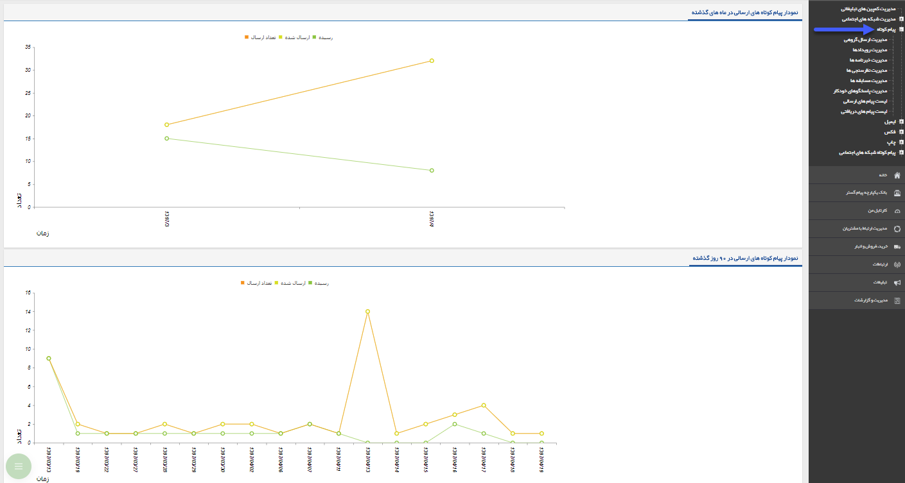

# (SMS) پیام کوتاه    

پیام کوتاه
----------

 [مدیریت ارسال گروهی](SMSTools/GroupSendManagement.md)
-------------------------------------------------------

 [رویداد تبلیغاتی](SMSTools/Advertisement.md)
----------------------------------------------

 [خبرنامه](SMSTools/News.md)
-----------------------------

 [نظرسنجی](SMSTools/Question.md)
---------------------------------

 [مسابقه](SMSTools/Competition.md)
-----------------------------------

 [پاسخگوی خودکار](SMSTools/AutoReply.md)
-----------------------------------------

 [پیام های دریافتی](SMSTools/GettingSMSList.md)
------------------------------------------------

 [پیام های ارسالی](SMSTools/SendingSMSList.md)

