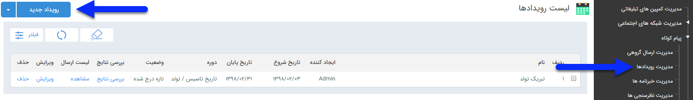

# رویداد تبلیغاتی    

 رویداد تبلیغاتی

برای ارسال پیام هوشمند در زمانبندی دقیق و پیشرفته، می توانید از رویداد تبلیغاتی استفاده کنید. در صفحه اول، می توان با تعیین تاریخ اجرا و زدن دکمه فیلتر، لیست برنامه های اجرا شده در گذشته را مشاهده کرد. اما برای اجرای یک برنامه جدید باید بر روی دکمه " رویداد جدید " در سمت راست و بالای صفحه کلیک کرده و با گذراندن چند گام ساده، برنامه را به راحتی اجرا کرد.

[گام 1- اطلاعات رویداد](HelpPayamgostar\AdvertisedTools\SMSTools\Advertisement\Step1.md) 

[گام 2- زمان اجرا](HelpPayamgostar\AdvertisedTools\SMSTools\Advertisement\Step2.md) 

[گام3- محتوای پیام](HelpPayamgostar\AdvertisedTools\SMSTools\Advertisement\Step3.md) 

[گام4- مدیریت مخاطبان](HelpPayamgostar\AdvertisedTools\SMSTools\Advertisement\Step4.md)

