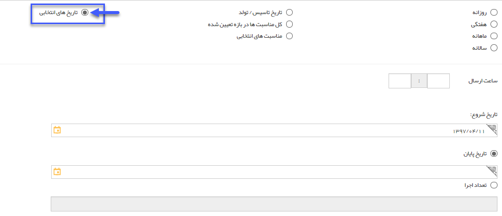

# گام 2- زمان بندی اجرا      

**گام 2- زمان بندی اجرا**

در این گام، سه نوع زمان بندی برای اجرای برنامه پیشنهاد می شود :

1**.** **زمان بندی دوره ای** \- به صورت انتخابی از شکل های روزانه، هفتگی، ماهانه و سالانه تعیین شده و بر اساس کادر بازه اجرا می توان به دو صورت این بازه را تعیین کرد :

یا شروع و پایان مورد نظر را تعیین کرد، و یا تاریخ شروع و تعداد دفعات اجرا را معلوم نمود.

**2.** **زمان بندی مناسبتی** \- به صورت انتخابی از تاریخ تاسیس شرکت/ تولد افراد و یا [مدیریت اعیاد و مناسبت ها](../../../BaseInformatio/EYDManagement.md) ، باید تاریخ شروع و پایان بازه اجرا را تعیین کرد.

 

**3.** **زمان بندی پیشرفته** \- با انتخاب این گزینه، در گام بعد یک و یا چند تاریخ از روی تقویم مشخص می شود و سپس برای هر کدام از تاریخ های مورد نظر، متن مناسب نوشته می شود .

تعداد اجرا: این فیلد به شما امکان تعریف تعداد تکرار در اجرای این برنامه را در تاریخ های تعیین شده می دهد.