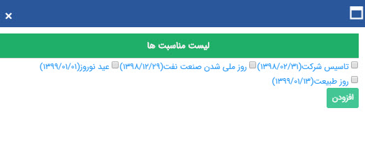
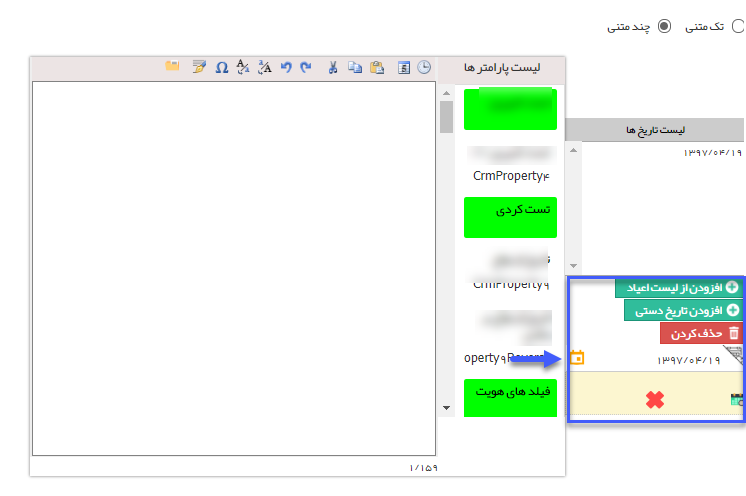

# گام 3- تنظیم متن      **

**گام 3- تنظیم متن**

**

 لطفا ابتدا به [گام دوم - محتوای پیام](../../ToolsSharedInformation/Step2messagecontent.md) در اطلاعات مشترک ابزارها مراجعه کنید.

1.حالت رویداد: در حالت تک متنی برای کلیه تاریخ های انتخابی فقط یک متن ارسال می شود و در حالت چند متنی می توانید برای هر تاریخ یک متن مشخص را ویرایش نمایید.

 

2\. لیست تاریخ ها: تاریخ های انتخاب شده را نمایش می دهد و با کلیک بر روی هرکدام می توانید پیامی که قرار است در آن تاریخ ارسال شود را مشخص نمایید.

3\. افزودن از لیست اعیاد: میتوانید یکی از اعیادی که در بازه زمانی انتخاب شده قرار گرفته اند را انتخاب کنید

 

4.افزودن تاریخ دستی: میتوانید تاریخ های مورد نظر را بصورت دستی وارد لیست تاریخ ها کنید.

 5.لیست پارامترها: از بین پارامترهای هوشمند، میتوانید پارامترهای متغیر در هر مخاطب را انتخاب و با دوبار کلیک آن را به متن پیام اضافه نمایید.

6\. متن پیام: میتوانید متن پیام رویداد را در اینجا بنویسید.