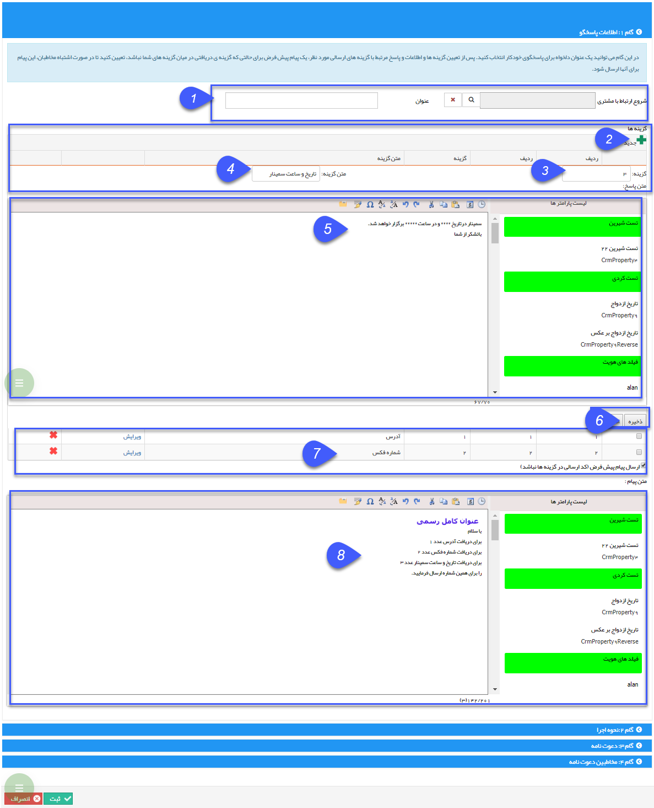

# گام 1- اطلاعات اولیه پاسخگو      ** 

گام 1- اطلاعات اولیه پاسخگو

1\. تعیین یک عنوان: نام این برنامه پاسخگوی خودکار را در قسمت عنوان تعیین میکنید. برای مثال "اطلاعات شرکت". برای ارتباط با کمپین هم می توانید، کمپین مورد نظر را در فیلد شروع ارتباط با مشتری انتخاب نمایید.

2\. گزینه جدید: بازدن این دکمه، یک گزینه اضافه می شود.

3. تعیین شماره: در این فیلد شماره گزینه ای را که مخاطب قرار است به عنوان انتخاب خود ارسال نماید را تعیین میکنید. برای مثال "1"

4\. متن گزینه: در این عنوان گزینه انتخاب می شود. برای مثال "شماره فکس"

5\. تعیین پاسخ های مناسب: متن هر گزینه را در اینجا انتخاب میکنید، برای مثال "شماره فکس شرکت 02144444444 می باشد، با تشکر از  شما"

6\. ذخیره: گزینه مورد نظر را ذخیره می کند.

7. گزینه های ساخته شده بصورت یک لیست در این قسمت نمایش داده می شوند.

8.پیام پیش فرض: هنگامی که مخاطب عددی بغیر از ، گزینه های تعیین شده بفرستد،این متن برایش ارسال می شود تا اعداد گزینه ها را به وی شرح دهد.

**