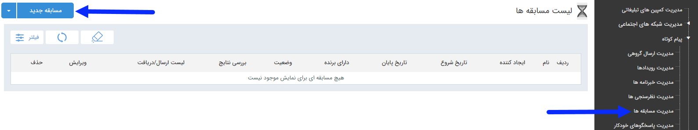

# مسابقه      

###  مسابقه

برای ارسال سوال و گزینه های مسابقه با تعیین گزینه صحیح و تعداد برندگان می توانید از مسابقه استفاده کنید. در صفحه اول، می توان با تعیین تاریخ اجرا و زدن دکمه فیلتر، لیست برنامه های اجرا شده در گذشته را مشاهده کرد. اما برای اجرای یک برنامه جدید باید بر روی دکمه " مسابقه جدید" در سمت راست و بالای صفحه کلیک کرده و با گذراندن چند گام ساده، برنامه را به راحتی اجرا کرد.

لطفا ابتدا  [اطلاعات مشترک ابزارها](../ToolsSharedInformation.md) را مطالعه فرمایید و طبق گام های زیر برای ارسال گروهی جدید اقدام فرمایید .

###      [گام 1- اطلاعات مسابقه](Competition/Step1.md)

###      [گام 2- نحوه اجرا](Competition/Step2.md)

###      [گام 3- تاییدیه](Competition/Step3.md)

###      [گام 4- دعوتنامه](Competition/Step4.md)

###      [گام 5- مخاطبین دعوتنامه](Competition/Step5.md)

### 