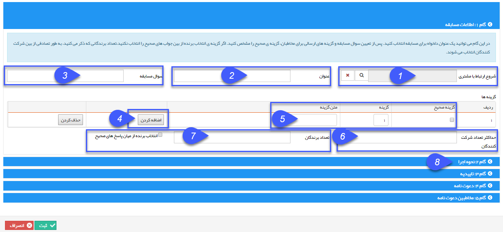

# گام 1- اطلاعات اولیه مسابقه    

گام 1- اطلاعات اولیه مسابقه

1.شروع ارتباط با مشتری: در این فیلد می توانید، کمپینی که مربوط به این مسابقه است را متصل کنید تا گزارش پیام های ارسالی و هزینه ها در کمپین لحاظ شود.

2\. تعیین یک عنوان: برای ثبت در لیست مسابقه ها، یک عنوان برای مسابقه انتخاب کنید.

3\. تعیین سوال مسابقه: سوال مسابقه در این فیلد باید مشخص شود.

4. اضافه کردن : ابتدا جهت تعریف گزینه ها، دکمه اضافه کردن را بفشارید تا امکان انتخاب گزینه ها براش شما ایجاد شود.

5\. گزینه ها: گزینه صحیح، شماره گزینه ها جهت ارسال مشتریان و عنوان هر گزینه را در این فیلد ها می نویسید و برای اضافه کردن گزینه، دکمه اضافه کردن را بفشارید.

6. حداکثر تعداد شرکت کنندگان : شما می توانید تعداد شرکت کنندگان را در این قسمت محدود نمایید.

7. تعداد برندگان: در این قسمت، می توانید تعداد برندگان از بین شرکت کنندگان را تعیین کنید و حتی تعیین کنید که در صورت پاسخ صحیح برنده در نظر گرفته شوند.

با زدن دکمه گام 2 به مرحله بعد خواهید رفت.

