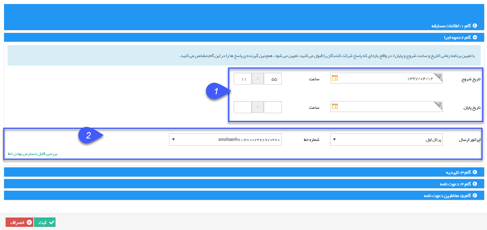

# گام 2- نحوه اجرا       

**گام 2- نحوه اجرا**

1. بازه اجرا :  تاریخ شروع و پایان بازه اجرا را با انتخاب از روی تقویم و ساعت، تعیین کنید.

2\. تعیین اپراتور ارسال : که شامل استفاده از پرتال اول، خطوط مگفا ورایان مارکتینگ(خطوط ثابت) می باشد.

نکته: در این نوع از ارسال داشتن خط جداگانه با قابلیت دریافت الزامی است، تا از طریق آن بتوان نظر مخاطبان را در بازه زمانی اجرای کمپین دریافت نمود ، در بازه اجرا خط مورد استفاده اشغال می باشد.

