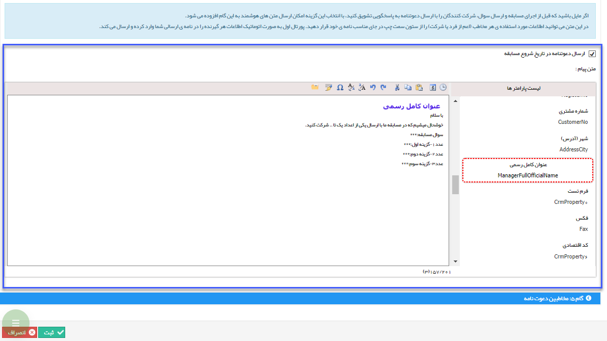

# گام 4- دعوتنامه      ** 

گام 4- دعوتنامه

در این گام می توان برای مخاطبان، متن دعوت به شرکت در مسابقه را ارسال نمود .

در بالای کادر متن هوشمند، تیک ارسال دعوتنامه را فعال کنید تا امکان استفاده از متن هوشمند (به عنوان یکی از ویژگی های خاص پیام گستر) در این گام برای شما فراهم شود.

**نکته: در صورتی که ارسال دعتونامه را در این قسمت فعال کرده باشید، این برنامه حداقل باید یک مخاطب داشته باشد تا اجرا شود.**

**

**** ****