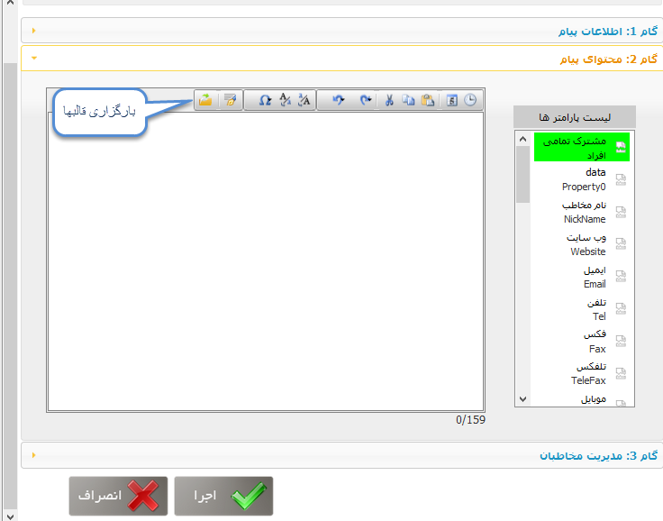

# گام 2- تنظیم متن      **

**گام 2- تنظیم متن**

**

در این گام می توانید متن مورد نظر برای ارسال را وارد کنید. از طریق منوی بالای صفحه (شامل فایل، قالب)، می توانید متون مورد نظر خود را از سیستم کامپیوتر خود به اینجا وارد کنید، یا از  [قالب هایی](../../../BaseInformatio/SMSFrameManagement.md) که برای راحتی کار شما در نظر گرفته شده، استفاده کنید.

همچنین امکان استفاده از  [متن هوشمند](../../InteligentContext.md) (به عنوان یکی از ویژگی های خاص پیام گستر) در این گام برای شما فراهم شده است.

