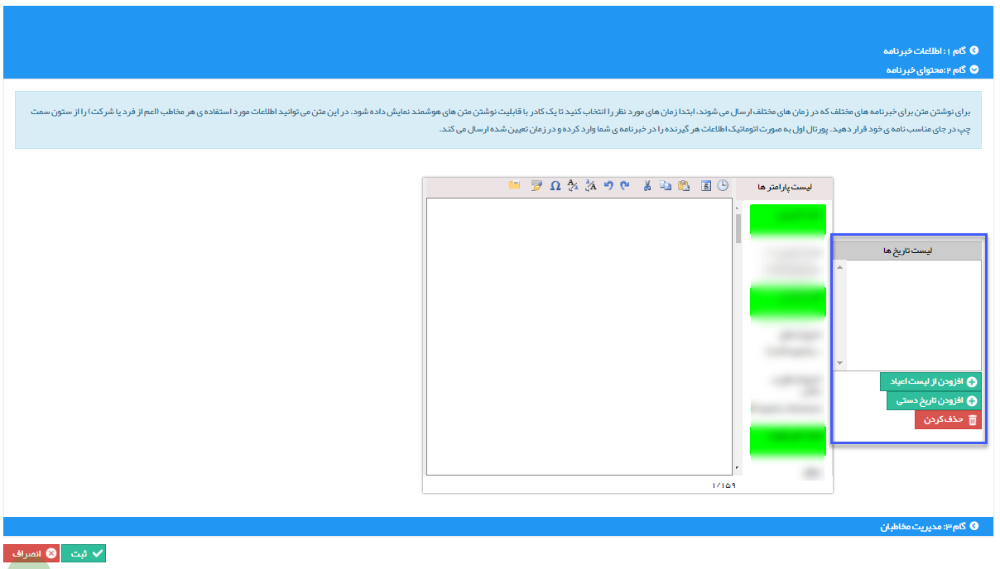

# گام 2- تنظیم متن    

** گام 2- تنظیم متن**

در این گام می توانید متن مورد نظر برای ارسال را وارد کنید. ابتدا از روی تقویم و یا [لیست مناسبت ها](../../../BaseInformatio/EYDManagement.md) ، یک و یا چند تاریخ را مشخص کنید.

لطفا به قسمت  [گام دوم - محتوای پیام](../../ToolsSharedInformation/Step2messagecontent.md)  در [اطلاعات مشترک ابزارها](../../ToolsSharedInformation.md)  مراجعه کنید.

برای اطلاع در خصوص انتخاب تاریخ ها به [گام 3- تنظیم متن](../Advertisement/Step3.md) رویداد تبلیغاتی مراجعه کنید.

در ابتدا تاریخ پیام ها و سپس متن پیام را می نویسیم و در نهایت با کلیک بر روی دکمه گام سوم وارد مرحله نهایی می شویم.

 