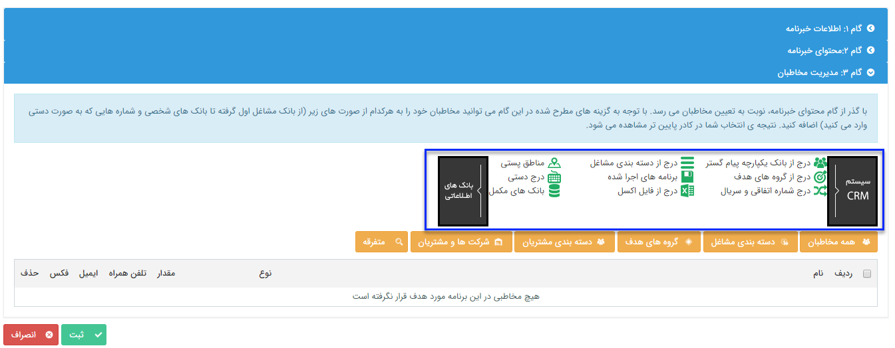

# گام 3- انتخاب مخاطبان        **    

گام 3- انتخاب مخاطبان

در قسمت  [انتخاب مخاطبان ارسال گروهی پیام کوتاه](../../ToolsSharedInformation/Step3SelectAudiences.md) توضیح داده شده است.

این مخاطبان باید شامل پروفایل هایی باشند که شماره تلفن همراه در آن ها وجود داشته باشد .

در این مرحله پس از انتخاب مخاطبان از بانک های اطلاعاتی، یک لیست از مخاطبان هدف ساخته می شود که با زدن دکمه ثبت، خبرنامه ایجاد و برنامه ی آن شروع به کار میکند.

 

  نکته:  با زدن دکمه سیستم CRM می توانید مخاطبان مرتبط با آیتم های مختلف نرم افزار (فاکتورها، فرصت ها و ...) را از منوهای این دسته بندی انتخاب کنید.

**