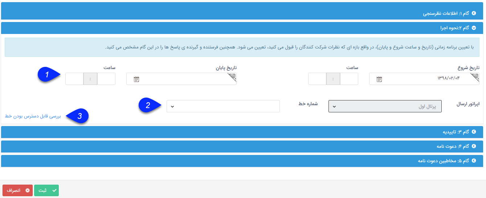

# گام 2- نحوه اجرا       

**گام 2- نحوه اجرا**

1. بازه اجرا : برای تعیین تاریخ شروع و پایان بازه اجرا با انتخابی از روی تقویم و ساعت

2\. تعیین اپراتور ارسال: که شامل استفاده از پرتال اول، خطوط مگفا و رایان مارکتینگ(خطوط ثابت) می باشد.

3\. نکته مهم: در این نوع از ارسال داشتن خط جداگانه با قابلیت دریافت الزامی است، تا از طریق آن بتوان نظر مخاطبان را در بازه زمانی اجرای کمپین دریافت نمود ، در بازه اجرا خط مورد استفاده اشغال می باشد.

4. با کلیک بر روی گام 3 وارد مرحله بعدی خواهیم شدیم.

