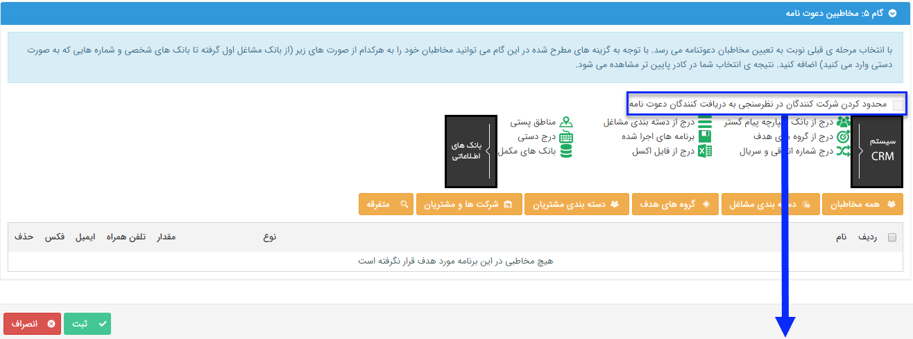

# گام 5- انتخاب مخاطبان دعوتنامه      **

**گام 5- انتخاب مخاطبان دعوتنامه**

**اگر در گام 4 تصمیم به ارسال دعوتنامه گرفته باشید، در این گام باید مخاطبان دعوتنامه را تعیین کنید.**

**در قسمت  [انتخاب مخاطبان](../../ToolsSharedInformation/Step3SelectAudiences.md) توضیح داده شده است.**

**این مخاطبان باید شامل پروفایل هایی باشند که شماره تلفن همراه در آن ها وجود داشته باشد .**

******نکته: هر برنامه حداقل باید یک مخاطب داشته باشد تا اجرا شود .**

** 

**با فعال کردن این گزینه فقط مخاطبانی که دعوت نامه را دریافت می کنند می توانند در نظرسنجی شرکت کنند.**