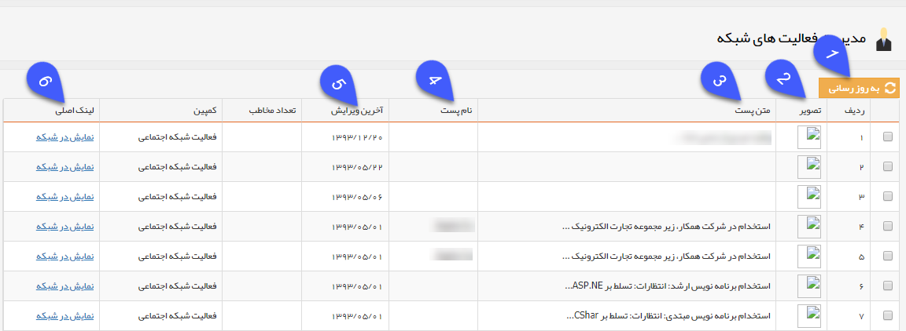

# مدیریت فعالیتهای شبکه    

**مدیریت فعالیت های شبکه**

------------------------------

در این صفحه سوابق مرتبط با فعالیت شبکه های اجتماعی را می توانید مشاهده کنید.

**1.به روز رسانی:** با زدن دکمه به روز رسانی، پست های آخر و تعداد مخاطبین تغییر پیدا کرده و به روز می شود.

**2.تصویر:** نمای کوچکی از تصویر بارگذاری شده در شبکه اجتماعی مربوطه(facebook) را به شما نمایش می دهد.

**3.متن پست:** متنی که زیر عکس ذکر شده میگذارید در این ستون نمایش داده می شود.

**4.نام پست:** عنوان و نام پست در این قسمت قابل مشاهده خواهد بود.

**5.لینک اصلی:** با زدن بر روی لینک هر کدام، وارد صفحه شبکه اجتماعی که پست گذاشته اید می شوید.