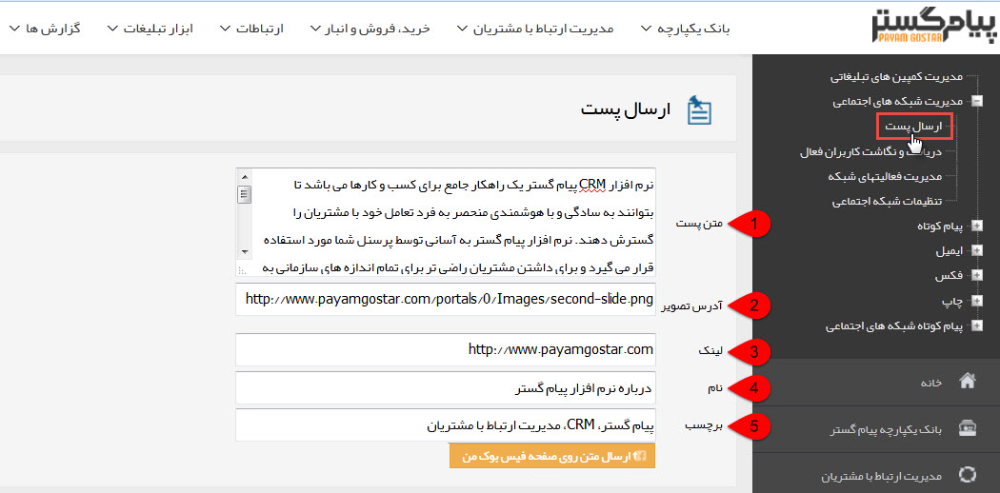

# ارسال پست    

**ارسال پست**

-----------------

برای ارسال پست باید از کاربرد قسمت های زیر مطلع باشید:

**1\. متن پست:** در این قسمت متن محتوای ارسالی را درج کنید.

**2\. آدرس تصویر:** لینک تصویر مرتبط با پست را در این قسمت درج کنید.(دقت کنید آدرس حتما باید پسوندی از خانواده عکس ها باشد)

**3\. لینک:** می توانید لینک صفحه مورد نظر خود را در این قسمت درج کنید تا مخاطبان با کلیک بر روی پست به این صفحه ارجاع داده شوند.

**4\. نام:** نام پست خود را برگزینید.

**5\. برچسب:** برچسب یا Tag های پست خود را درج کنید.