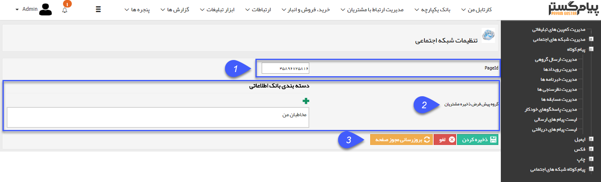

# تنظیمات شبکه اجتماعی    

**تنظیمات شبکه اجتماعی**

----------------------------

 

**1. PageId:** آی دی صفحه مورد نظر را در این قسمت درج کنید.

**2\. گروه پیشفرض ذخیره مشتریان:** گروه ذخیره مخاطبان فیسبوک را در مخاطبان من انتخاب کنید.

**3. به روز رسانی مجوز:** پس از وارد کردن آی دی صفحه فیسبوک، با استفاده از این دکمه و فعال بودن موقت یک ابزار رفع فیلتر، می توانید مجوز ارسال و دریافت از سایت فیسبوک (Token) را در نرم افزار ذخیره کنید.

نکته: این مجوز هر سه ماه یکبار نیاز به بروز رسانی دارد.