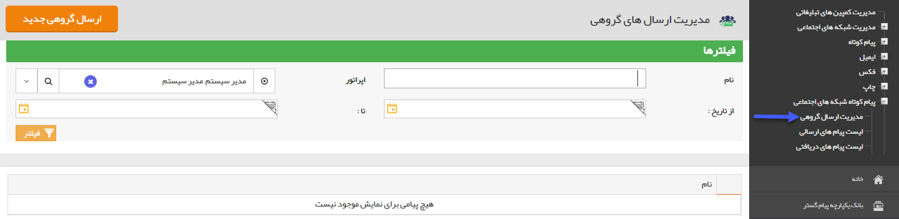

# مدیریت ارسال گروهی    

مدیریت ارسال گروهی 
-------------------

**

لطفا ابتدا[اطلاعات مشترک ابزارها](../ToolsSharedInformation.md) را مطالعه فرمایید و طبق گام های زیر برای ارسال گروهی جدید اقدام فرمایید.

[گام اول - اطلاعات اولیه ارسال گرو هی](../ToolsSharedInformation/Step1messageinfo.md)

[گام دوم - محتوای پیام](../ToolsSharedInformation/Step2messagecontent.md)

[گام سوم -انتخاب مخاطبان](../ToolsSharedInformation/Step3SelectAudiences.md)

برای اجرای یک برنامه جدید باید بر روی دکمه"ارسال گروهی جدید" در سمت راست و بالای صفحه کلیک کرده و با گذراندن چند گام ساده، برنامه را به راحتی اجرا کنید.

لیست برنامه های اجرا شده قبلی در کادر پایین صفحه نمایش داده می شود و از همین قسمت می توانید تاریخ اجرا، تاریخ ثبت، وضعیت برنامه را مشاهده کنید و همچنین با کلیک بر روی مشاهده نتایج و تحلیل برنامه ، نتایج ارسال و نمودارهای برنامه را مشاهده کنید.

نکته: برنامه هایی که وضعیت آن ها تمام شده است قابلیت ویرایش ندارند و ویرایش تنها برای برنامه های تازه درج شده است. (وضعیت برنامه ها تازه درج شده و یا تمام شده است.)

نکته: می توان با تعیین عنوان برنامه و یا تاریخ اجرا و زدن دکمه فیلتر، لیست برنامه های اجرا شده در گذشته را  بر اساس پارامتر مشخص شده مشاهده کرد.

**