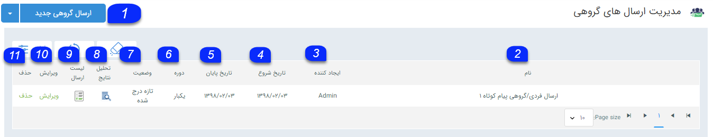
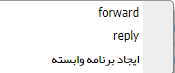
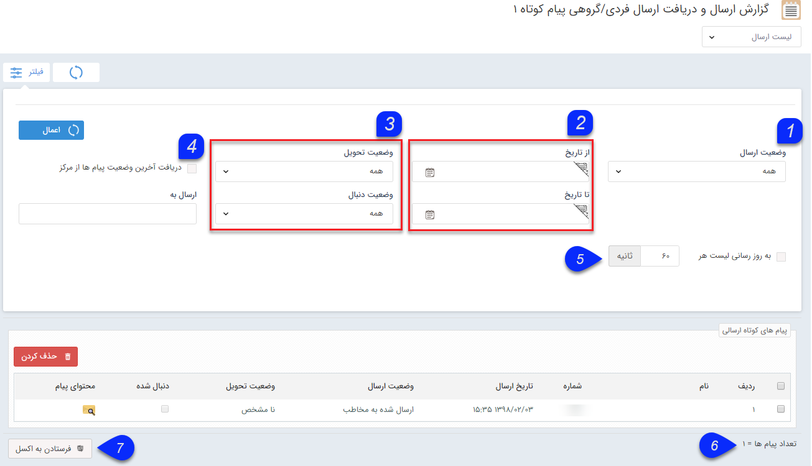
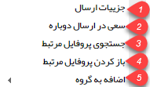
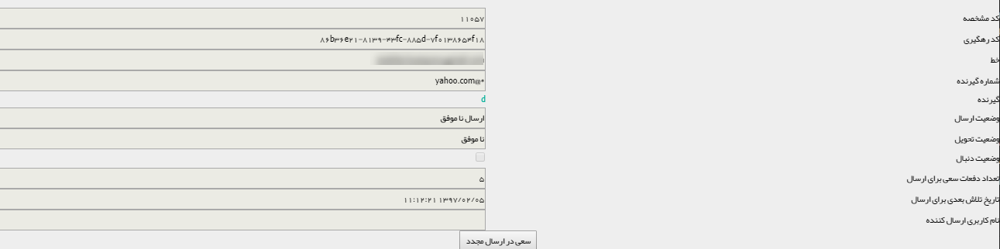
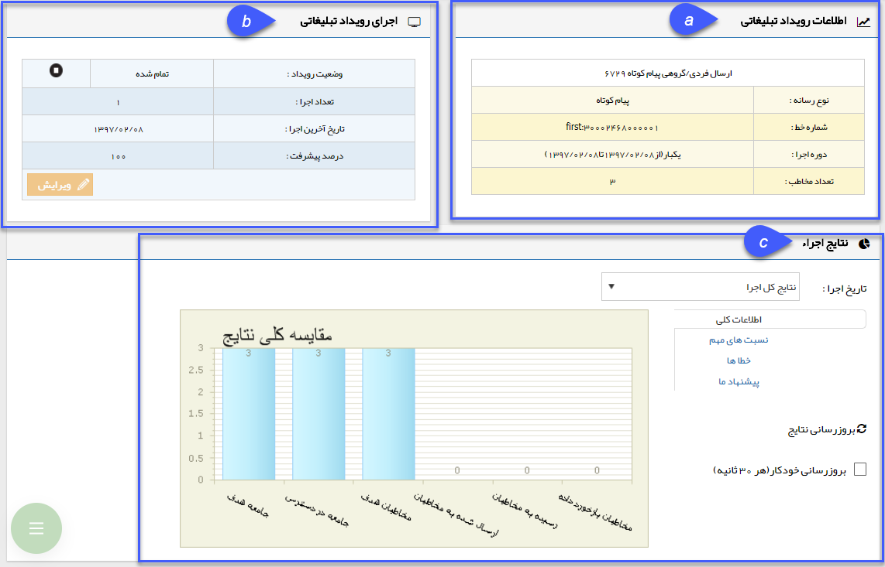

# اطلاعات مشترک ابزارها        

**اطلاعات مشترک بین ابزارها**

بدون در نظر گرفتن رسانه ارسال(پیام کوتاه، فکس، ایمیل)، هر برنامه تبلیغاتی شامل 3 مرحله یکسان می شود. (البته برنامه هایی مانند نظرسنجی و پاسخگو و ... دارای مراحل خاص دیگری نیز هستند.)

این 3 مرحله به ترتیب زیر می باشد.

1\. [گام اول - اطلاعات پیام](ToolsSharedInformation/Step1messageinfo.md)

2\. [گام دوم - محتوای پیام](ToolsSharedInformation/Step2messagecontent.md)

3\. [گام سوم -انتخاب مخاطبان](ToolsSharedInformation/Step3SelectAudiences.md)

نکته: قبل از اجرای انبوه، پیام تنظیم شده را یک بار برای خود ارسال نمایید تا بتوانید از صحت اجرای برنامه اطمینان حاصل نمایید.

پس از اجرای هر برنامه:

بعد از اجرا هر برنامه در صفحه مدیریت ارسال گروهی در لیست برنامه ها، می توانید برنامه جدید را مشاهده نمایید که در لیست برنامه قرار گرفته شده است.

 

**1\. ارسال گروهی جدید:** میتوانید یک ارسال گروهی جدید را آغاز کنید.

**2\. نام:** عنوانی که برای ارسال انتخاب شده را نمایش میدهد.

**3\. ایجادکننده:** کاربر ایجاد کننده ارسال گروهی را نمایش میدهد.

**4\. تاریخ شروع:** تاریخ شروعی که برای ارسال در نظر گرفته شده را نمایش میدهد.

**5\. تاریخ پایان:** تاریخ پایان ارسال را نمایش میدهد.

**7\. وضعیت:**قسمت [اطلاعات مشترک لیست ارسال پیام](../Communications/SentlistCommoninfo.md) را مطالعه کنید.

**8\. تحلیل نتایج:** نتایج مرتبط با این ارسال را می توانید مشاهده کنید. (به[نمودارهای تحلیلی برنامه های تبلیغاتی](AdvertismentProgrameChart.md) مراجعه کنید.)

**9\. لیست ارسال:** نمایش وضعیت ارسال تک تک مخاطبان را میتوانید مشاهده کنید.

**10\. ویرایش:** تنها برنامه هایی قابلیت ویرایش دارند که وضعیت آن ها تازه درج شده است.

**11\. حذف:** در صورتی که برنامه تازه درج شده باشد و حذف شود، ارسالی صورت نمی گیرد ولی در صورتی که وضعیت برنامه تمام شده باشد و برنامه را حذف نمایید، برنامه اجرا شده است و با حذف آن تنها نتایج برنامه را مشاهده نمی کنید.

**کلیک راست****:** بر روی یک برنامه شامل موارد زیر می باشد :

 

·  **Forward:**  اجرای این برنامه با مخاطبان جدید

**·**  **Reply:**  اجرای برنامه جدید به مخاطبان این برنامه

·  **ایجاد برنامه وابسته  :** برنامه ی مرتبط با یک برنامه، برنامه ای است با تنظیمات و مخاطبان جدیدی نسبت به برنامه قبلی.تصور کنید که گروه و یا دسته ای را به عنوان مخاطبان یک برنامه انتخاب کرده اید و به تمام اعضای گروه پیامی را ارسال کرده اید. در هفته های آینده تعداد جدیدی مخاطب به دسته بندی موردنظر افزوده شده است و شما می خواهید همان پیام به آن ها ارسال شود، به جای اجرای یک برنامه جدید می توانید برنامه مرتبط با آن برنامه را اجرا نمایید، منتها در این برنامه تنها به مخاطبانی ارسال صورت می گیرد که در برنامه قبلی حضور نداشتند. (بدون ارسال تکراری ها )

یا تصور نمایید دسته ای را به عنوان مخاطبان یک برنامه انتخاب کرده اید  و تعدادی از آن ها را به صورت تصادفی انتخاب می کنید و برنامه ای اجرا می شود. درروزهای آینده می توانید برنامه مرتبطی را اجرا کنید که مخاطبان تصادفی برنامه قبل در این برنامه مرتبط وجود نداشته باشد.**)**

**لیست ارسال یک برنامه تبلیغاتی:**

در برنامه های دوطرفه مانند پاسخگو، مسابقه، نظرسنجی که علاوه بر ارسال پیام، قابلیت دریافت پیام را نیز دارا هستند با تغییر لیست ارسال به لیست دریافت، امکان مشاهده پیام هایی که از سمت مشتریان و مخاطبان برای پاسخ به این برنامه ارسال شده است وجود دارد .

**1\. وضعیت ارسال:** در این قسمت می توانید پیام ها را بر اساس وضعیت ارسال فیلتر کنید.

**2\. تاریخ از/تا:** بازه تاریخی مد نظر جهت مشاهده از این دو فیلد قابل تغییر می باشد.

**3** **. وضعیت پیام ها:** در این قسمت وضعیت تحویل و دنبال قابل فیلتر شدن می باشد.

**4\. آخرین وضعیت پیام ها:** با انتخاب این گزینه، آخرین وضعیت ارسال و تحویل از مرکز گرفته شده و پس از فیلتر کردن نمایش داده می شود.

**5\. به روز رسانی لیست:** با زدن این دکمه، سیستم بصورت خودکار هر 60 ثانیه(زمان در فیلد مقابل قابل تغییر است) پیام های جدید را چک و لیست پیام های ارسالی را به روز رسانی می نماید.

**6\. تعداد پیام ها:** تعداد کل پیام های در لیست در این قسمت قابل مشاهده می باشد.

**7\. فرستادن به اکسل: **با کلیک بر روی این دکمه، از لیست فیلتر شده، یک خروجی اکسل دریافت خواهید کرد.

**نکته:** برای نمایش محتوای پیام بر روی لینک نمایش(ستون محتوای پیام) در انتهای هر سطر کلیک کنید .

کلیک راست بر روی یک پیام شامل موارد زیر است :

**1.** **جزئیات** **ارسال:** در این قسمت جزییات مرتبط با ارسال پیام مانند کد رهگیری و وضعیت تحویل و ارسال را می توانید مشاهده کنید.

**2.** **سعی در ارسال دوباره:** این پیام دوباره ارسال خواهد شد . (برای مشاهده وضعیت های مختل ف ارسال به قسمت [اطلاعات مشترک لیست ارسال پیام](../Communications/SentlistCommoninfo.md) مراجعه کنید.)

**3.** **جستجوی پروفایل مرتبط:** پروفایل هایی که در نرم افزار شامل این شماره و یا ایمیل هستند را نمایش می دهد .

**4.** **باز کردن پروفایل مرتبط:** در صورتی که بسته به رسانه تبلیغاتی، اطلاعات شماره و یا ایمیل موردنظر، در پیام گستر ثبت شده باشد، با انتخاب این گزینه پروفایل مربوط به این شماره و یا ایمیل بازخواهد شد .

**5.** **اضافه به گروه:** در صورتی که شماره و یا ایمیل مربوط به یک پروفایل در پیام گستر باشد، می توان از همین بخش آن را به [گروه هدف](../PayamGostarSyncBank/PerposeOfGroups.md) خاصی برای پیگیری های آینده اضافه نمود .

**تحلیل نتایج:**

شامل نمودارهای تحلیلی است که بر اساس نتایج به دست آمده از برنامه اجرا شده، تشکیل و نمایش داده می شوند. این قسمت از سه بخش اطلاعات رویداد تبلیغاتی، اجرای رویداد تبلیغاتی ونتایج اجرا تکیل شده است.

**a.اطلاعات رویداد تبلیغاتی:** در این بخش، نوع رسانه، شماره و یا آدرس رسانه، تعداد دفعات تکرار و تعداد مخاطبان مشخص می شود.

**b.اجرای رویداد تبلیغاتی:** در این بخش وضعیت رویداد(تمام شده، درحال اجرا و ..) تعداد دفعات اجرا و تاریخ آخرین ارسال به همراه درصد پیشرفت ارسال ها مشخص می شود.

 **c. نتایج اجرا:**

ستون اول: جامعه هدف تعیین کننده تمام مخاطبانی است که برای ارسال پیام تبلیغاتی خود، آن ها را انتخاب می کنید. این جامعه هدف می تواند از ترکیب مختلف بانک یکپارچه پیام گستر (مانند مشتریان من، نتایج جستجو ، مخاطبان برنامه های اجرا شده قبلی و ...) تشکیل شود. در این مثال، کاربر 2 نفر را برای فرستادن پیام تبلیغاتی انتخاب کرده است.

ستون دوم: منظور از جامعه در دسترس تمام کسانی هستند که می توانند با توجه به ابزار و رسانه ی انتخابی شما، مخاطب پیام تبلیغاتی باشند. در این مثال، چون کاربر از رسانه پیام کوتاه استفاده نموده، از ستون قبلی که 2 نفر بودند، 2 شماره موبایل موجود بوده و این تعداد در دسترس می باشند .

ستون سوم: مخاطبان هدف حاصل انتخاب شما از تمام کسانی است که در دسترس هستند. عواملی نظیر بودجه تبلیغات، ارسال در زمان های مختلف، ارسال پیام های متفاوت با محتوای مختلف و یا ارسال پیام به تعدادی از مخاطبان با هدف تبلیغاتی مختلف، می تواند باعث شود کاربر مورد نظر از میان 2 مخاطب که می توانستند مخاطب این برنامه تبلیغاتی باشند، 2 نفر را انتخاب کند.

ستون چهارم: تعداد پیام ارسال شده به مخاطبان را نشان می دهد. منظور از این تعداد، پیام هایی است که از نرم افزار خارج شده و برای ایمیل، تلفن همراه و یا فکس مخاطبان ارسال شده است. در صورتی که آدرس ایمیل و یا شماره تلفن همراه و فکس مخاطبان اشتباه باشد، ستون چهارم از ستون سوم کمتر خواهد شد. در این مثال، از 2 نفری که به آن ها پیام ارسال شده است، برای 1 نفر پیام از مخابرات به گوشی آن ها ارسال شده است .

ستون پنجم: تعداد پیام های رسیده در ایمیل معادل پیام هایی است که در صندوق (Inbox) ایمیل مخاطب باز شده و مشاهده شده است. در مورد تلفن همراه و فکس هم این عدد نشانه ی دریافت در دستگاه موبایل و فکس گیرنده پیام است. تعداد پیام های رسیده به دلایلی نظیر این که گیرنده ایمیل متن شما را مطالعه نکند و یا خط فکس اشغال بوده و یا موبایل مخاطب در دسترس نبوده و یا خاموش باشد، ممکن است از تعداد ارسال ها کمتر باشد . در این مثال، 0 گزارش دریافت (Delivery Report) از گوشی مخاطبان به مخابرات ارسال شده است .

ستون ششم: بازخوردها همان عکس العمل مخاطبان پیام های شما هستند. کسانی که به پیام کوتاه شما پاسخ می دهند، و همچنین کسانی که بر روی  [لینک ویژه](../Email/InteligentEmail.md) در متن ایمیل ارسالی شما کلیک می کنند تا به آدرس اینترنتی مورد نظر شما بروند، در این ستون معلوم می شوند. این مثال یک ارسال گروهی ساده است و بازخوردی دریافت نمی کند .