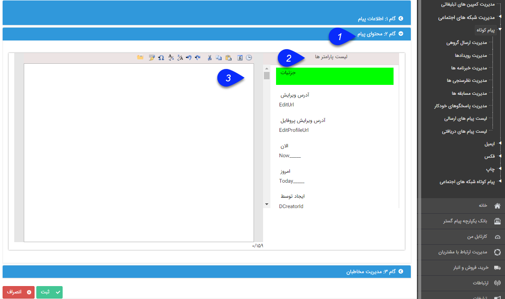
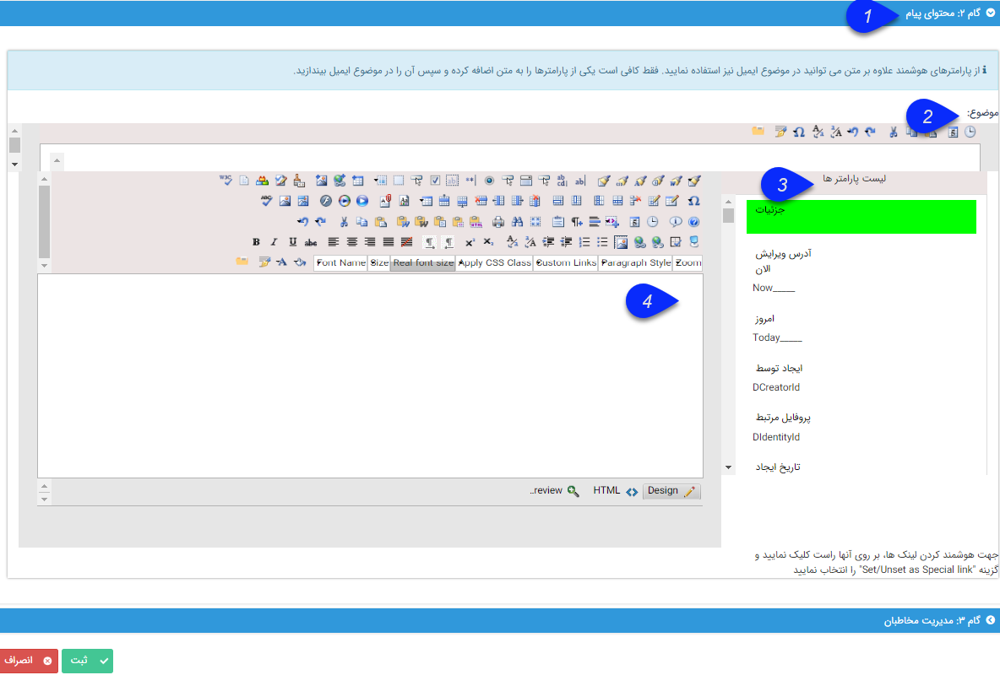
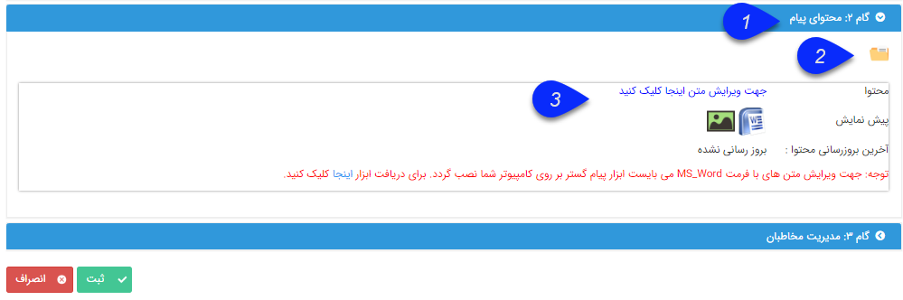

# گام دوم - محتوای پیام        

گام دوم - محتوای پیام

در این گام محتوای پیام خود را می توانید تعیین کنید. این محتوا بستگی به رسانه مورد نظر دارد.

نکته: می توانید از قالب های ذخیره شده در [مدیریت قالب پیام ها](../../BaseInformatio/SMSFrameManagement.md) یک پیام را انتخاب کنید و ارسال نمایید. (به [انتخاب قالب پیام](Step2messagecontent/TemplateSelection.md) مراجعه کنید.)

نکته: می توانید امضای خود را در نرم افزار ذخیره کنید تا بتوانید آن را به انتهای پیام اضافه کنید. (به [اضافه کردن امضا](Step2messagecontent/Sign.md) مراجعه کنید.)

[**محتوای پیامک**](SMSTools.md) : 1. متن پیام برای ارسال به مخاطبان  برنامه پیام کوتاه : نوع پیام، متن ساده است.

در این نوع ارسال می توانید از [متن هوشمند](InteligentContext.md)استفاده کنید.

نکته: عدد زیر صفحه ارسال پیام، تعداد کاراکترهای موجود و تعداد پیام های پیامک را نشان می دهد.

 

2\. لیست پارامترها: در این منو شما میتوانید از فیلدهای در دسترس، بعنوان کلمه متغیر استفاده نمایید.

**محتوای [ایمیل (رایانامه)](Email.md)** **:** نوع پیام، HTML

در این نوع از محتوا علاوه بر متن هوشمند می توانید از عکس و یا لینک های ویژه Hyperlink نیز استفاده کنید.

1\. با استفاده از این گزینه می توانید تصویر به ایمیل خود اضافه کنید. (به قسمت [طریقه ایجاد یک ایمیل عکس دار](../Email/CreateAnEmailWithImage.md) مراجعه کنید.)

2\. با استفاده از این گزینه می توانید یک لینک به ایمیل خود اضافه کنید. (مانند آدرس سایت دلخواه)

3\. [لینک ویژه](../Email/InteligentEmail.md) : با راست کلیک بر روی یک لینک می توانید آن را به صورت ویژه تعیین کنید. در گزارشات مربوط به این ارسال تعداد مخاطبانی که بر روی این لینک کلیک کرده اند را نیز می توان مشاهده کرد.

**برنامه** [**فکس**](Fax.md) **و** [**پرینت**](Print.md) : نوع پیام، متن Word

نحوه ویرایش یک پیام برای فکس و پرینت را همانند [تنظیم قالب چاپ](../../Setting/Personalizing/Totalview/printpreviewdesign.md) میتوانید انجام دهید.

