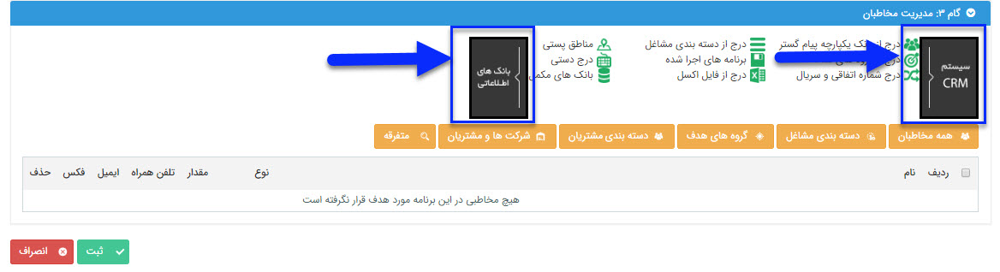

# گام سوم - انتخاب مخاطبان      **

**گام سوم- انتخاب مخاطبان**

******

**با توجه به گزینه های مطرح شده در کادر بالای این گام که به دو دسته بانک های اطلاعاتی و سیستم** **CRM** **دسته بندی شده است، با کلیک بر روی هر کدام از این دو کادر زیرشاخه های آن ها نمایش داده می شود و می توانید مخاطبان برنامه تبلیغاتی خود را به راحتی انتخاب نمایید.** 

****

************