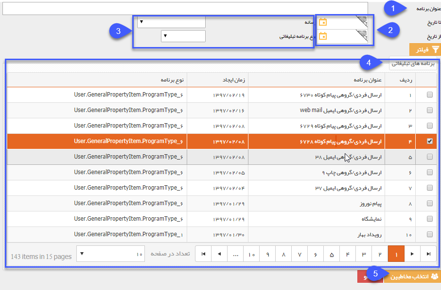
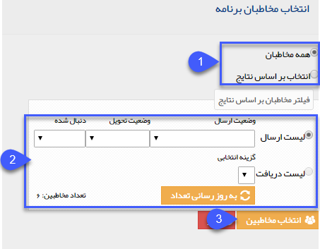

# برنامه های اجرا شده    

**برنامه های اجرا شده**

**

**می توانید از مخاطبان   برنامه هایی که قبلا اجرا نموده اید و وضعیت آن ها تمام شده است در یک برنامه جدید استفاده نمایید.**

**1.عنوان برنامه: عنوان برنامه جهت جستجو را در این فیلد بنویسید.**

**2\. تاریخ: تاریخ اجرای برنامه تبلیغاتی مورد نظر را در این قسمت می توانید فیلتر نمایید.**

**3. می توان جهت فیلتر بهتر نوع رسانه تبلیغاتی(ایمیل، پیامک، فکس و شبکه اجتماعی) و برنامه تبلیغاتی (رویداد، خبرنامه، پاسخگوی خودکار، نظرسنجی، مسابقه، خبرنامه و ارسال گروهی) را انتخاب نمود.**

**4. پس از جستجو برنامه مورد نظر، روی برنامه مورد نظر کلیک نمایید.**

5. با کلیک بر روی انتخاب مخاطبین، وارد صفحه تنظیمات مخاطبان خواهید شد که پایینتر توضیح داده شده است.

**

انتخاب مخاطبان برنامه:

1. همه مخاطبان،برای ارسال به تمامی مخاطبانی که لیست ارسال برای آنها تشکیل شده است و انتخاب بر اساس نتایج مخاطبان، بر اساس وضعیت ارسال به مخاطب فیلتر کنید.

2\. فیلتر براساس نتایج: در این قسمت می توانید، لیست ارسال را براساس وضعیت ارسال به مخاطب(درصف ارسال، ارسال شده به مخاطب،ارسال به مرکز و ..) ، وضعیت تحویل (نامشخص، تحویل داده شد و ناموفق) و دنبال شده(دنبال شده و دنبال نشده) انتخاب نمایید.

3\. انتخاب مخاطبین : با کلیک بر روی این دکمه،  بر اساس فیلترهای انجام شده، مخاطبین به لیست شما افزوده خواهند شد.