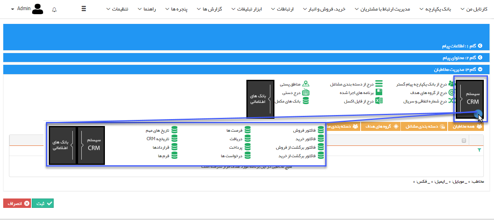

# انتخاب از روی سیستم 

**انتخاب از سیستم CRM:**

**با استفاده از ابزارهای این قسمت می توانید مخاطبان مرتبط با آیتم های مختلف سیستم (فاکتورها، فرصت ها و ...) انتخاب کنید،**

**برای مثال تمامی فاکتور فروش هایی که در سه ماهه سال جاری صادر شده اند.**

**سیستم CRM شامل :**

[فاکتور فروش](../../Buysaleswarehouse/Factors.md)

[فاکتور خرید](../../Buysaleswarehouse/Buyfactor.md)

[فاکتور برگشت از فروش](../../Buysaleswarehouse/Returnfactor.md)

[فاکتور برگشت از خرید](../../Buysaleswarehouse/Returnbuyfactor.md)

[فرصت ها](../../CRM/Apportunity.md)

[دریافت](../../Buysaleswarehouse/Recive.md)

[پرداخت](../../Buysaleswarehouse/Payment.md)

[درخواست ها](../../CRM/Requests.md) 

[تاریخ های مهم](../../CRM/LinkedDates.md) 

[تاریخچه CRM](../../CRM/CRMHistory.md)

[قراردادها](../../Buysaleswarehouse/Contract.md)

[فرم ها](../../CRM/Forms.md)