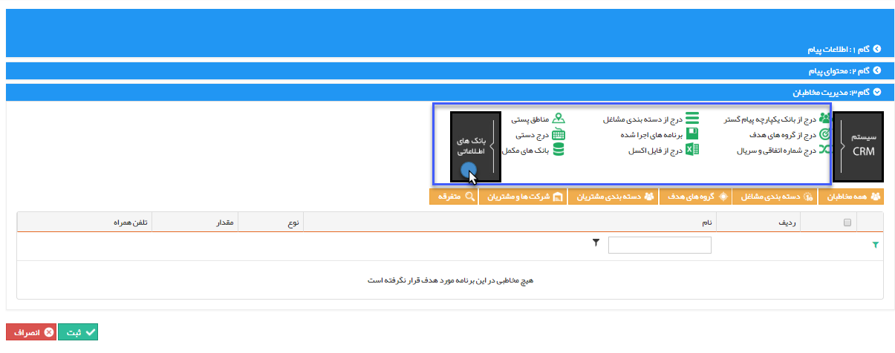

# انتخاب از روی بانک اطلاعاتی

**انتخاب از بانک های اطلاعاتی:**

**با استفاده از ابزارهای این قسمت می توانید مخاطبان را به لیست ارسال اضافه کنید.**

**بانک های اطلاعاتی شامل:**

**

[درج از بانک یکپارجه پیام گستر](Step3SelectAudiences/SyncBank.md)

**[درج از دسته بندی مشاغل](Step3SelectAudiences/Jobs.md)**

[مناطق پستی](Step3SelectAudiences/TehranPostPart.md)

[درج از گروه های هدف](Step3SelectAudiences/PerposeGroups.md)

[برنامه های اجرا](Step3SelectAudiences/RunPrograme.md) شده

[درج دستی](Step3SelectAudiences/Insert.md)

[درج شماره اتفاقی و سریال](Step3SelectAudiences/Serial.md)

****

[درج از فایل اکسل](Step3SelectAudiences/Excell.md)

**

**[بانک های مکمل](Step3SelectAudiences/Banks.md)**