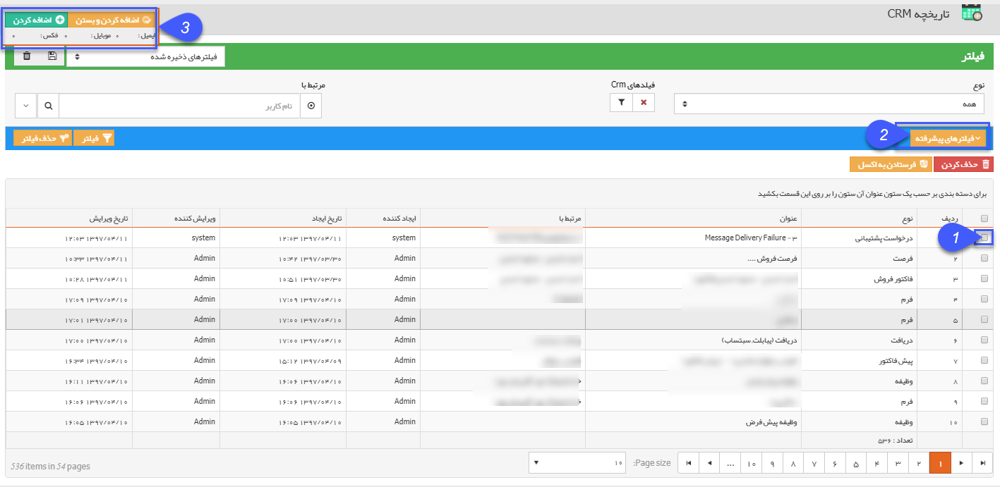

# تاریخچه CRM

**درخواست ها **

جهت انتخاب مخاطبان تبلیغات گروهی در قسمت سیستم، می توانید از انواع آیتم های ثبت شده درسیستم بصورت یکجا در تاریخچه CRM استفاده نمایید.  در تصویر زیر انتخاب مخاطبین از روی تاریخچه CRM نمایش داده شده است.

  

1- باکلیک بر روی کادر مشخص شده، مخاطب مورد نظری که در قسمت مرتبط با در فرم مشخص شده، بعنوان مخاطب این ارسال گروهی تعیین می شود. شما با کلیک بر روی مربع ردیف های دیگر می توانید مخاطبان دیرگ را هم به لیست ارسال اضافه نمایید.

2-در صورتی که نیاز به محدود کردن لیست و مخاطبان دارید، کافی است از فیلدهای موجود در فیلترهای پیشرفته استفاده نمایید و یا با استفاده از فیلد نوع، آیتم مورد نظر را انتخاب نمایید. شایان ذکر است شما می توانید روند فیلتر را چندین دفعه انجام داده . مخاطبان را از آیتم های مختلف انتخاب نمایید.

3- در انتها تعداد مخاطبین بصورت تعداد موبایل، تعداد ایمیل و فکس منتخب، در کادر بالا نمایش داده می شود.