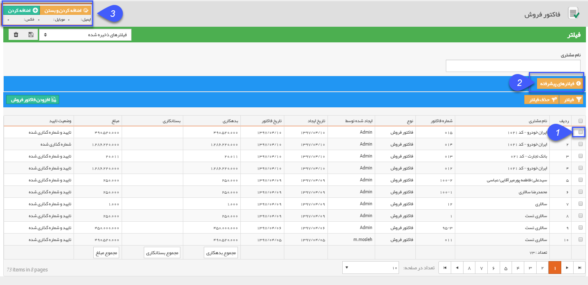

# آیتم های مالی

**آیتم های مالی**

جهت انتخاب مخاطبان تبلیغات گروهی در قسمت سیستم، می توانید از انواع آیتم های مالی مانند پیش فاکتور، فاکتور، دریافت و پرداخت و .... استفاده نمایید. لازم به ذکر است که مراحل انتخاب در تمام آیتم های ذکر شده به یک روش می باشدو در تصویر زیر انتخاب مخاطبین از روی فاکتور ها که در سیستم ثبت شده، نمایش داده شده است. 

با  1- باکلیک بر روی کادر مشخص شده، مخاطب مورد نظری که در قسمت مرتبط با در فاکتور مشخص شده، بعنوان مخاطب این ارسال گروهی تعیین می شود. شما با کلیک بر روی مربع ردیف های دیگر می توانید مخاطبان دیرگ را هم به لیست ارسال اضافه نمایید.

2-در صورتی که نیاز به محدود کردن لیست و مخاطبان دارید، کافی است از فیلدهای موجود در فیلترهای پیشرفته استفاده نمایید.

3- در انتها تعداد مخاطبین بصورت تعداد موبایل، تعداد ایمیل و فکس منتخب، در کادر بالا نمایش داده می شود.