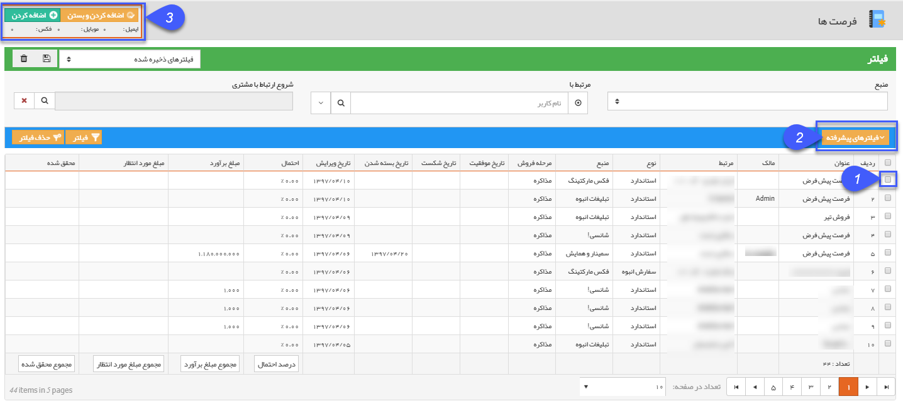

# فرصت

**فرصت ها **

جهت انتخاب مخاطبان تبلیغات گروهی در قسمت سیستم، می توانید از انواع فرصت های ثبت شده درسیستم استفاده نمایید.  در تصویر زیر انتخاب مخاطبین از روی فرصت ها ی ثبت شده در سیستم، نمایش داده شده است.

1- باکلیک بر روی کادر مشخص شده، مخاطب مورد نظری که در قسمت مرتبط با در فرصت مشخص شده، بعنوان مخاطب این ارسال گروهی تعیین می شود. شما با کلیک بر روی مربع ردیف های دیگر می توانید مخاطبان دیرگ را هم به لیست ارسال اضافه نمایید.

2-در صورتی که نیاز به محدود کردن لیست و مخاطبان دارید، کافی است از فیلدهای موجود در فیلترهای پیشرفته استفاده نمایید.

3- در انتها تعداد مخاطبین بصورت تعداد موبایل، تعداد ایمیل و فکس منتخب، در کادر بالا نمایش داده می شود.