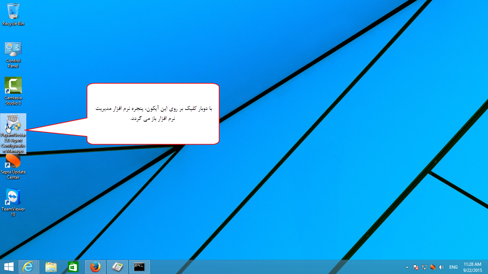

# پشتیبان گیری و بروزرسانی        

**مدیریت پشتیبان گیری**

مشاهده سرویس های در حال اجرای پیام گستر، شناسایی GSM مودم، مسیر نصب و سریال نرم افزار و پشتیبان گیری از نرم افزار در برنامه Payamgostar Agent Configuration Manager که در سرور (جایی که نرم افزار نصب شده است) وجود دارد، قابل دسترسی است.

****

**تهیه نسخه پشتیبان:** از این بخش می توانید برای حفاظت از اطلاعات موجود در نرم افزار استفاده کنید.در نتیجهاین فرآیند، از وضعیت حال حاضر نرم افزار شما یک کپی تهیهشده و در صورت بروز مشکلات غیر منتظره، می توان اطلاعات را به همان شکل بازخوانی کرد.

قسمت مرتبط با[نسخه پشتیبان](Backup/BackupVersion.md) مطالعه کنید.

[وبسایت پیام‌گستر](payamgostar.com)