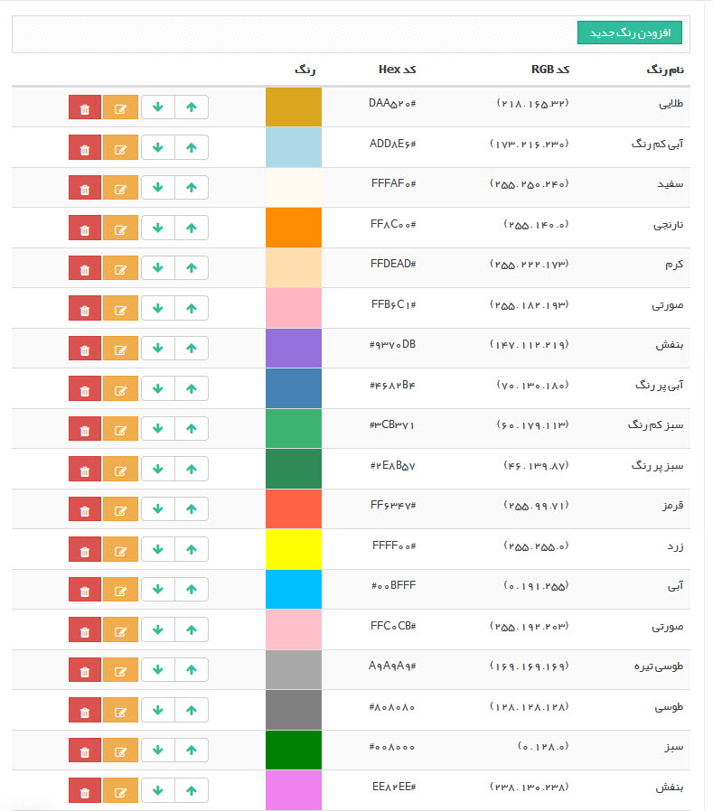
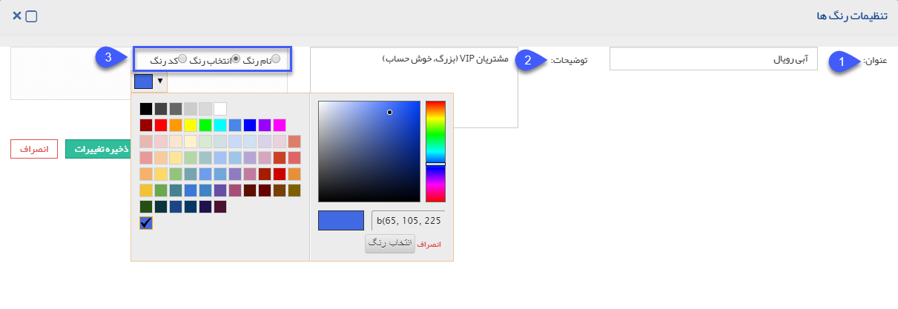
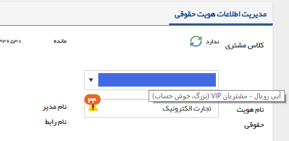

# مدیریت رنگ ها    

مدیریت رنگ ها

در این قسمت می توانید رنگ هایی که بصورت پیشفرض در نرم افزار موجود است را تغییر دهید. یا در صورت نیاز نیاز رنگ جدیدی اضافه کنید.

توجه کنید که از این رنگ ها در رنگ بندی تقویم ها، هویت ها، اقدام های فرآیندهای کاری و ... استفاده می شود.

رنگ جدید:

 

1\. **عنوان:** نام رنگ مورد نظر را انتخاب کنید.

2\. **توضیحات:** توضیحات رنگ را بنویسید. در واقع با استفاده از توضیحات، معنی این رنگ را مشخص می کنید، زیرا این توضیحات به صورت متن راهنما به کاربران نمایش داده می شود.

 

3. **انتخاب رنگ:** میتوانید که نام رنگ یا انتخاب رنگ یا کد رنگ را برای تعیین آن استفاده کنید