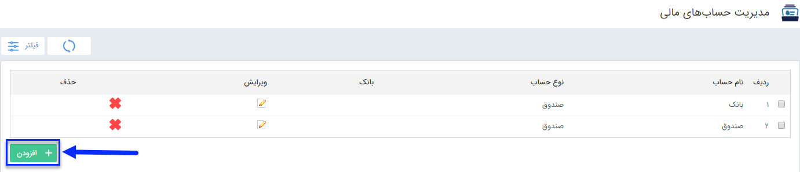
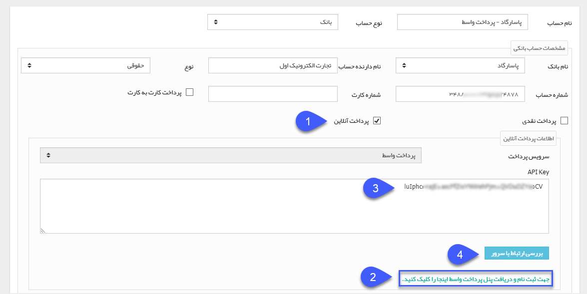
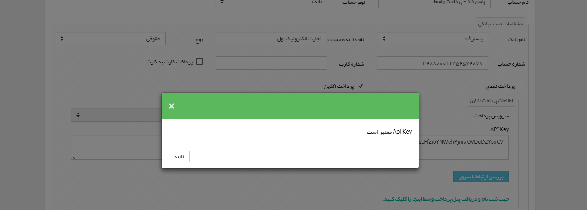

# مدیریت حساب های مالی    

**مدیریت حساب های مالی**

از این قسمت می توانید برای مدیریت حساب های مالی و مدیریت ثبت پرداخت مالی استفاده نمایید .

با کلیک برروی دکمه اضافه کردن، اطلاعات حساب های شرکت خود را می توانید ثبت نمایید. در ثبت دریافت/پرداخت در پروفایل هویت ها در قسمت واریز به/ برداشت از، این حساب ها نمایش داده می شود و شما می توانید از بین حساب ها، حساب مورد نظر را انتخاب نمایید .

**__**

1\. در صورتی که ماژول پرداخت واسط را خریداری کرده باشید، می توانید گزینه مربوط به پرداخت آنلاین را فعال کرده و با ثبت نام در پنل پرداخت واسط و وارد کردن API Key ارائه شده از طریق این پنل در نرم افزار، اقدام به ایجاد لینک پرداخت برای مشتریان خود نمایید. همچنین در صورتی که ماژول پرداخت آنلاین را خریداری کرده باشید، مشتریان می توانند در داشبورد باشگاه مشتریان خود از طریق درگاه پرداخت واسط اقدام به پرداخت آنلاین و واریز وجه به حساب های تعریف شده در این قسمت نمایند.

نکته: توجه داشته باشید برای پرداخت آنلاین در باشگاه مشتریان، باید ماژول های پرداخت واسط و پرداخت آنلاین را تهیه کرده باشید.

نکته: گزینه های پرداخت نقدی و پرداخت کارت به کارت، مربوط به تعریف حساب های مجاز برای ثبت دریافت توسط مشتری در باشگاه مشتریان می باشد. برای اطلاعات بیشتر به [داشبورد مشتریان](../MajolhayeTakmili/BashgaheMoshtarian/DashboardeMoshtarian.md) مراجعه کنید.

2\. با کلیک بر روی این لینک به سایت پرداخت واسط هدایت می شوید تا اقدام به ثبت نام و تعریف حساب های مالی خود در این سایت نمایید.

3\. پس از ثبت نام و تعریف حساب مالی خود در پنل پرداخت واسط، API Key ارائه شده توسط این پنل را در این قسمت وارد نمایید.

4\. پس از وارد کردن API Key برای بررسی معتبر بودن آن، روی این دکمه کلیک کنید. در صورت مشاهده پیغام زیر، اطلاعات به درستی وارد شده است و می توانید از این حساب برای ایجاد لینک پرداخت استفاده نمایید.

