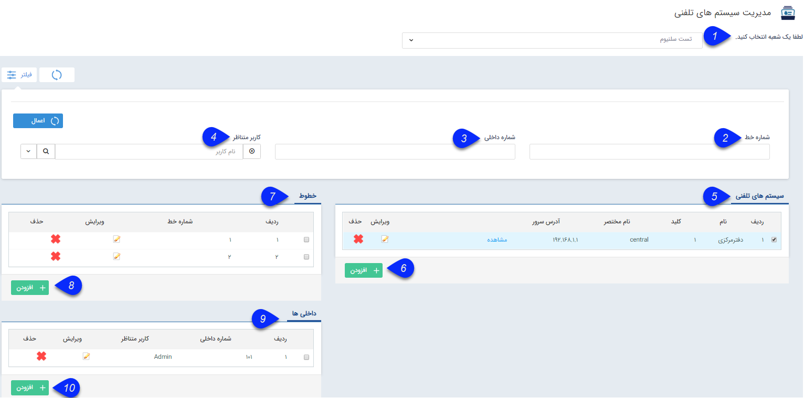
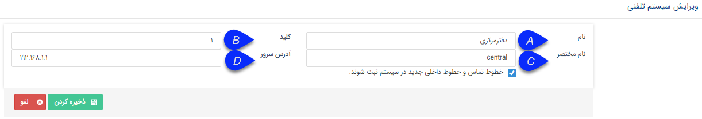
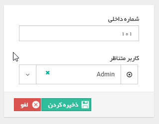

# مدیریت سیستم های تلفنی    

مدیریت سیستم های تلفنی

در این قسمت تنظیمات مرتبط با سیستم های تلفنی انجام می شود. توجه داشته باشید که پس از تعیین شعبه، باید سیستم های تلفنی را اضافه نمایید و سپس خطوط تلفنی و داخلی های متناظر با کاربران را برای آن ها تعریف نمایید.

 

1. انتخاب شعبه: ابتدا شعبه ای را که می خواهید سیستم های تلفنی را برای آن تنظیم نمایید، باید انتخاب شود. این شعب از قسمت [مدیریت شعب، دپارتمان ها و سمت](../BranchManagement.md) ایجاد می شوند.

2\. شماره خط: با استفاده از این فیلد می توانید شماره خط مورد نظر را فیلتر نمایید.

3\. شماره داخلی: می توانید داخلی بخصوصی را فیلتر نمایید.

4\. کاربر متناظر: اگر داخلی های کاربری را می خواهید جستجو کنید از این فیلد استفاده نمایید.

5\. سیستم های تلفنی: سیستم های تلفنی تعریف شده در این لیست نمایش داده می شوند. با کلیک بر روی کلید"مشاهده" صفحه مرتبط با [وضعیت کنونی مرکز تماس](../../Windows/CIDstatus.md)نمایش داده خواهد شد.

6\. اضافه کردن سیستم تلفنی: با استفاده از این کلید می توانید یک سیستم تلفنی جدید ایجاد نمایید.

 

A. نام: نام سیستم تلفنی را درج نمایید.

B. کلید: کلیدی که در نرم افزار TelephonyAgent برای مشخص کردن سیستم تلفنی وارد شده است را در این فیلد درج نمایید. 

C. نام مختصر: می توان یک نام کوتاه برای سیستم تلفنی برای سهولت در یافتن آن در لیست سیستم های تلفنی درج نمایید.

D. آدرس سرور: آدرس سروری که سانترال به آن متصل شده یا سرور VOIP بر روی آن نصب شده است را درج نمایید.

E. ثبت خطوط جدید: با فعال کردن این گزینه، نرم افزار به صورت خودکار داخلی هایی که به سیستم تلفنی اضافه می شوند را به لیست داخلی های تحت نظارت نرم افزار اضافه می کند. (تنها در سیستم هایی که در لاگ خروجی خود داخلی ها را ارسال می کنند -مانند سانترال های TDE یا Voip- قابل استفاده است.)

7\. خطوط: لیست خطوط هر سیستم تلفنی در این لیست نمایش داده می شود.

8\. اضافه کردن خطوط: با فشردن این کلید می توانید خطوط دلخواه را به سیستم تلفنی خود اضافه نمایید.

9\. داخلی ها: لیست داخلی های مرتبط با هر سیستم تلفنی در این قسمت نمایش داده می شود.

10\. اضافه کردن داخلی جدید: با کلیک بر روی این دکمه می توانید داخلی های مختلف را به نرم افزار اضافه نمایید.

  

برای اضافه کردن هر داخلی باید شماره داخلی و نام کاربری که از آن داخلی استفاده می کند را درج کنید. از این داخلی ها در [لیست تماس های](../../CRM/Calls.md) نرم افزار استفاده می شود. همچنین در [گزارشات](../../ManagementAndReports/CRMReports/Calls.md) و [محدودیت های مشاهده تماس های ورودی](../../Setting/TotalSetting/Calls.md)، تعیین این داخلی ها نقش حیاتی دارند.