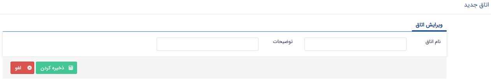

# مدیریت اتاق ها    

مدیریت اتاق ها

در این قسمت اتاق هایی که به عنوان محل ملاقات برای [قرار های ملاقات](../PayamGostarSyncBank/JobsForFirst/Background/NewMeeting1.md) در نظر گرفته می شوند را می توانید ایجاد و مدیریت کنید.

نکته: در صورتی که ماژول قرار ملاقات پیشرفته را تهیه کرده باشید، مدیریت اتاق ها به صورت خودکار توسط سیستم در هنگام ثبت قرار ملاقات انجام خواهد شد، یعنی نرم افزار از ثبت دو قرار ملاقات در بازه زمانی و اتاق مشابه جلوگیری خواهد کرد. 

1\. **لیست اتاق ها:** لیست اتاق هایی که قبلا اضافه شده اند را میتوانید در این قسمت مشاهده کنید.

2\. **اضافه کردن:** با استفاده از این گزینه می توانید یک اتاق جدید برای نرم افزار ایجاد کنید.

