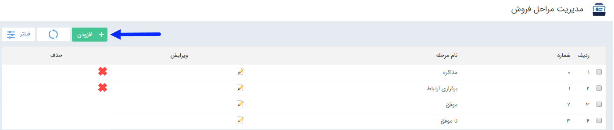
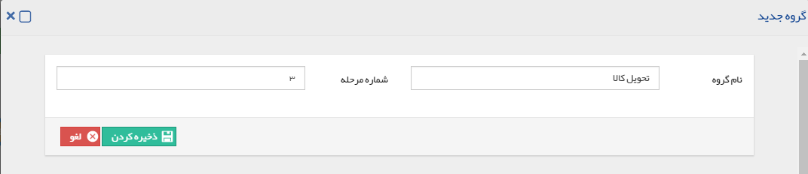

# مدیریت مراحل فروش      **

**مدیریت مراحل فروش**

**

باتوجه به این که  شرکت ها از روش های مختلفی برای فروش محصولات و خدمات خود استفاده می نمایند، مراحل فروش در شرکت های مختلف  تفاوت دارد. مراحلی به صورت کلی در این قسمت قرار داده شده است ، ولی می توانید با توجه به روال های کاری شرکت خود مراحل فروش محصول، کالا و یا خدمات را مدیریت نمایید. شما می توانید گزینه های موجود را حذف یا ویرایش نمایید و یا مرحله فروش جدیدی اضافه نمایید. از این مراحل فروش، برای ثبت فرصت های فروش استفاده می شود.

نکته: توجه داشته باشید مراحل فروش موفق و ناموفق قابل حذف نیستند، زیرا نشان دهنده چگونگی به سرانجام رسیدن فرصت های فروش می باشند و با استفاده از آن ها و تعیین دلایل موفقیت و شکست فرصت های فروش، می توان گزارشات تحلیلی فرصت ها را دراختیار داشت. 

__

با کلیک بر روی دکمه اضافه کردن پنجره زیر نمایش داده می شود و می توانید یک مرحله فروش جدید تعریف نمایید. نام مرحله و شماره آن (جهت ترتیب نمایش آن ها در لیست) را مشخص کرده و آن را ذخیره کنید.

