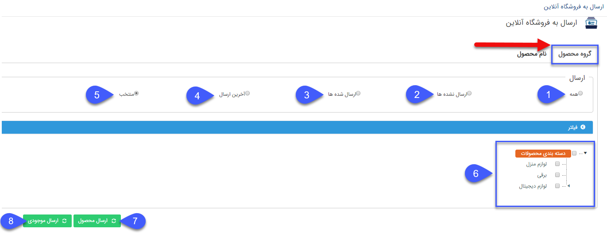
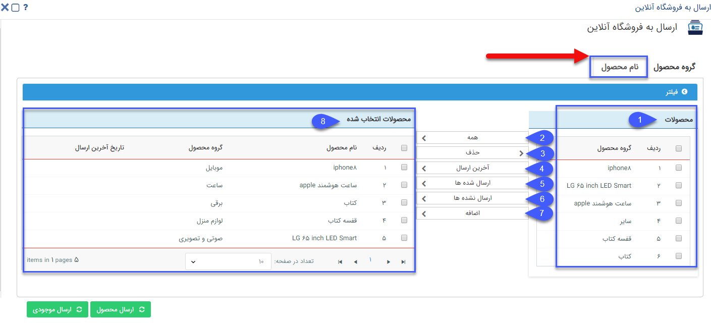

# ارسال به فروشگاه آنلاین

**فروشگاه آنلاین**

امکان ارسال محصولات به فروشگاه آنلاین به دو روش صورت می گیرد:

1. گروه محصول

2. نام محصول

**نکات:**

1\. تنها کاربری که مجوز "مدیریت محصولات" را دارد می تواند محصولات را به فروشگاه آنلاین ارسال نماید.

2\. کاربر انجام دهنده عملیات ارسال دستی محصولات به فروشگاه آنلاین، باید در تنظیمات فروشگاه، تعریف شده باشد.

**1: گروه محصول**

در بخش ارسال محصول با استفاده از گروه محصول، کاربر امکان انتخاب یکی از گزینه های زیر را به منظور ارسال محصولات به فروشگاه آنلاین خواهد داشت: 

 1. همه: ارسال همه گروه های محصول به فروشگاه آنلاین

2. ارسال نشده ها : ارسال گروه محصولاتی که تا به حال به فروشگاه آنلاین ارسال نشده اند.

3. ارسال شده ها : ارسال گروه محصولاتی که قبلا به فروشگاه آنلاین ارسال شده اند.

4\. آخرین ارسال : ارسال گروه محصولاتی که در مرتبه آخر ارسال، به فروشگاه آنلاین ارسال شده اند.

5\. منتخب : با انتخاب این گزینه کاربر گروه محصولاتی را به صورت دستی برای ارسال به فروشگاه آنلاین انتخاب خواهد کرد.

6.  برای انتخاب گروه محصولات مورد نظر کاربر امکان جستجوی گروه مورد نظر خود را دارد. به این منظور کاربر درختواره گروه های محصول و فیلتر مورد نیاز را در اختیار دارد.

7. از این قسمت برای ارسال گروه محصولات انتخاب شده به فروشگاه آنلاین استفاده می شود.

8. از این قسمت برای ارسال موجودی گروه محصولات انتخاب شده به فروشگاه آنلاین استفاده می شود. دکمه ارسال موجودی در این قسمت، موجودی کل گروه انتخاب شده و زیر گروه های آن را به فروشگاه آنلاین ارسال می کند.

نکته: موجودی هر محصول، مجموع موجودی محصول در کلیه انبارهایی است که محصول در آنها ثبت شده است.

**2: نام محصول**

در بخش ارسال محصول با استفاده از نام محصول، کاربر کلیه محصولات را در اختیار داشته و برای انتخاب محصولات قابل ارسال به فروشگاه آنلاین می تواند به یکی از شیوه های زیر عمل کند:

1\. این قسمت برای انتخاب محصولات به صورت دستی برای ارسال به لیست محصولات انتخاب شده استفاده می شود. (پس از انتخاب محصولات مورد نظر برای ارسال به فروشگاه آنلابن،گزینه اضافه را انتخاب کنید.)

2. همه: برای انتقال همه محصولات موجود در سیستم به فروشگاه آنلاین استفاده می شود.

3\. حذف: برای حذف محصولات از لیست محصولات منتخب برای ارسال استفاده می شود.

4\. آخرین ارسال: برای انتقال مجدد محصولاتی که در آخرین ارسال به فروشگاه آنلاین ارسال شده اند استفاده می شود.

5\. ارسال شده ها: برای انتقال همه محصولاتی که تا به حال به فروشگاه آنلاین ارسال شده اند استفاده می شود.

6.ارسال نشده ها: برای انتقال محصولاتی که تا بحال به فروشگاه آنلاین ارسال نشده اند استفاده می شود.

7. اضافه: برای جستجو و انتخاب محصولات مورد نظر و ارسال به فروشگاه آنلاین استفاده می شود. (این جستجو روی کلیه محصولات انجام می شود.)

8\. محصولات انتخاب شده: محصولاتی که جهت ارسال، یا ارسال موجودی به فروشگاه آنلاین انتخاب شده اند در نهایت در این لیست نمایش داده می شوند.

با کلیک روی ارسال محصول یا ارسال موجودی محصول، می توانیم محصولات انتخاب شده را به فروشگاه آنلاین ارسال کنیم.

نکته: جهت همگام سازی اتوماتیک محصولات از پیام گستر به فروشگاه آنلاین، به قسمت [فروشگاه آنلاین](../Setting/TotalSetting/OnlineShop.md) در تنظمیات مراجعه کنید.