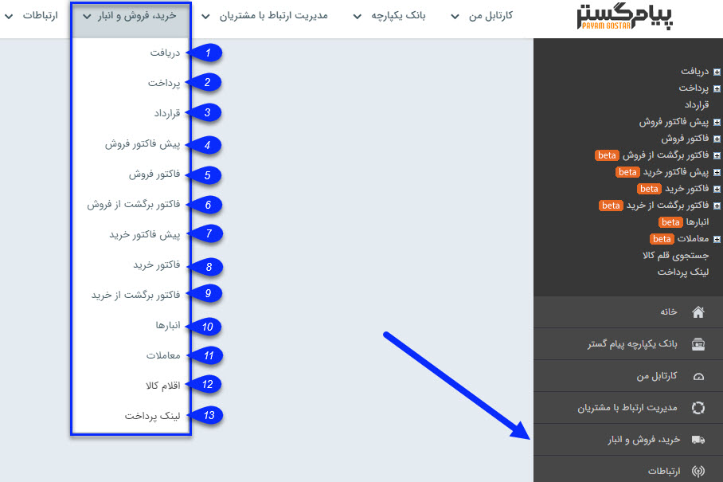

# خرید فروش انبار    

**خرید فروش انبار**

در این بخش تمامی آیتم های مرتبط با سوابق خرید، فروش و مالی هویت ها و همچنین اطلاعات انبار قابل مشاهده، ویرایشو اضافه کردن است.

 

1\. [دریافت](Buysaleswarehouse/Recive.md)

2\. [پرداخت](Buysaleswarehouse/Recive.md)

3\. [قرارداد](Buysaleswarehouse/Contract.md)

4\. [پیش فاکتور فروش](Buysaleswarehouse/Pishfactor.md)

5\. [فاکتور فروش](Buysaleswarehouse/Pishfactor.md)

6\. [فاکتور برگشت از فروش](Buysaleswarehouse/Pishfactor.md)

7\. [پیش فاکتور خرید](Buysaleswarehouse/Pishfactor.md)

8\. [فاکتور خرید](Buysaleswarehouse/Pishfactor.md)

9\. [فاکتور برگشت از خرید](Buysaleswarehouse/Pishfactor.md)

10\. [انبارها](Buysaleswarehouse.md)

11\. [معاملات](Buysaleswarehouse/Transactions.md)

12\. [اقلام کالا](Buysaleswarehouse\Transactions\Goodsitems.md)

13\. [لینک پرداخت](Buysaleswarehouse\PaymentLinks.md)