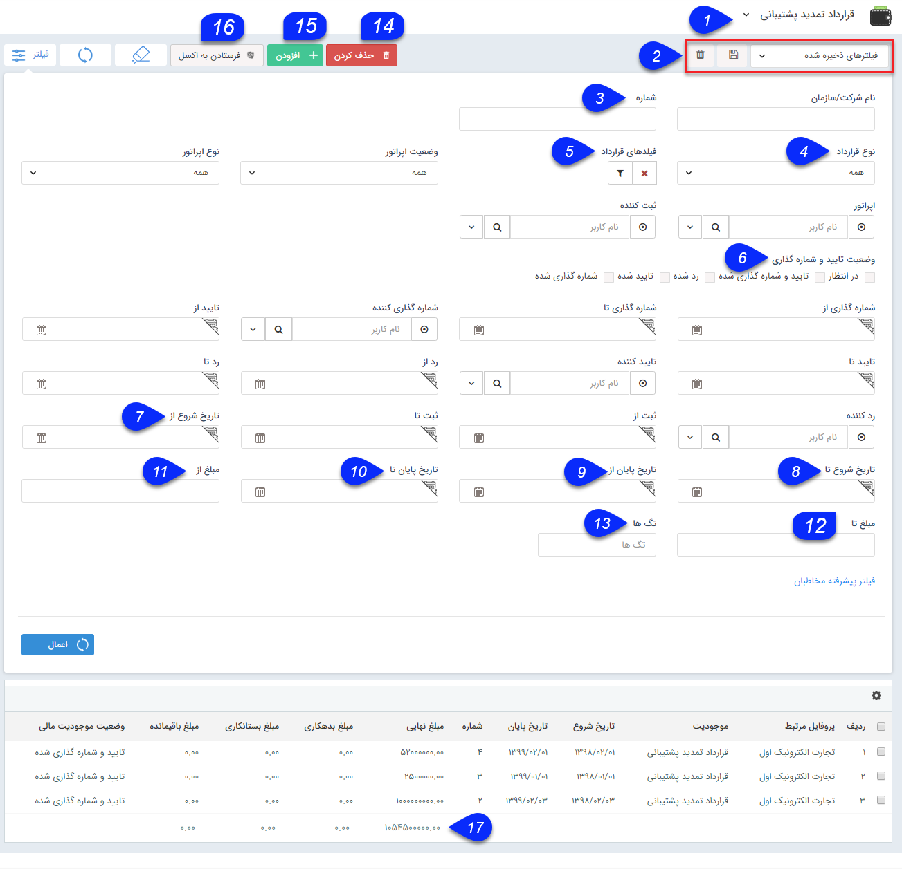

# قرارداد    

**قراردادها**

تمام قراردادهای تنظیم شده برای هویت های موجود، نمایش داده می شود. می توانید بر اساس پارامترهای مختلف جستجو نمایید و قرارداد موردنظر خود را پیدا نمایید. همچنین امکان ایجاد قرارداد جدید یا ویرایش قراردادهای موجود نیز در این قسمت وجود دارد.

نکته: هر کاربر می تواند تنها قراردادهایی که خود ثبت نموده است مشاهده نماید و تنها کاربر دارای مجوز "مشاهده لیست" قراردادها می تواند کلیه قراردادهای ثبت شده توسط سایر کاربران سیستم را مشاهده نماید.

 

نکته:لطفا ابتدا قسمت [فیلترهای پیشرفته](../../PayamGostarSyncBank/JobsForFirst/Background/AdvancedFilters.md)  را مطالعه کنید.  

1. **زیرنوع آیتم:** زیرنوع قراردادها از این قسمت قابل تغییر است.

2.  **نوع فیلتر:** میتوانید فیلترهای اعمال شده را به عنوان یک فیلتر اختصاصی خود ذخیره کنید.

3.  **شماره:**می توانید شماره یا بخشی از شماره قرارداد را در این قسمت برای جستجو وارد کنید.

4.  **نوع قرارداد:** می توانید نوع قرار داد (مالی یا حقوقی) را تعیین کنید.

5. **فیلدهای قرارداد:** می توانید با استفاده از دکمه فیلتر موجود در این فیلد، روی فیلدهای اضافه شده نیز فیلتر مورد نظر خود را اعمال کنید. .

6.  **وضعیت تایید و شماره گذاری:**  می توانید وضعیت تایید و شماره گذاری قراردادهای مورد نظر خود را از بین حالت های مختلف آن در این قسمت انتخاب کنید.

7. **تاریخ شروع از:** می توانید یک حد پایین برای تاریخ شروع قرارداد تعیین کنید.

8. **تار یخ شروع تا:** می توانید یک حد بالا برای تاریخ شروع قرارداد تعیین کنید.

9.  **تاری خ پایان از:** می توانید یک حد پایین برای تاریخ پایان قرارداد تعیین کنید.

10. **تاریخ پایان تا:** می توانید یک حد بالا برای تاریخ پایان قرارداد تعیین کنید.

11.**مبلغ از:** می توانید حد پایین مبلغ قرارداد را درج کنید.

12.  **مبلغ تا:** می توانید حد بالای مبلغ قرارداد را درج کنید.

13. **تگ ها:** می توانید قراردادها را بر اساس تگی که روی آن ها گذاشته اید جستجو کنید.

14. **حذف کردن:** می توانید سابقه قرارداد انتخاب شده را حذف کنید.

15.**اضافه کردن:**می توانید بک سابقه [قرارداد جدید](../../PayamGostarSyncBank/JobsForFirst/Contract/Newcontract.md) ایجاد کنید.

16.**فرستادن به اکسل:**می توانید سوابق فیلتر شده را در قالب فایل اکسل دریافت نمایید.

17\. **مجموع مبلغ:** درداین ستون می توانید به سادگی مجموع مبلغ قراردادهای فیلتر شده را محاسبه کنید.

نکته:با راست کلیک بر روی قراردادها می توانید اقدام به ویرایش گروهی یا افزودن سابقه برای آن ها کنید.

نکته:همانطور که قابل ملاحظه است، امکان تعیین حد پایین یا بالا برای تاریخ های شماره گذاری، تایید و رد قرارداد و همچنین تعیین کاربر شماره گذاری کننده، تایید کننده و رد کننده نیز وجود دارد.