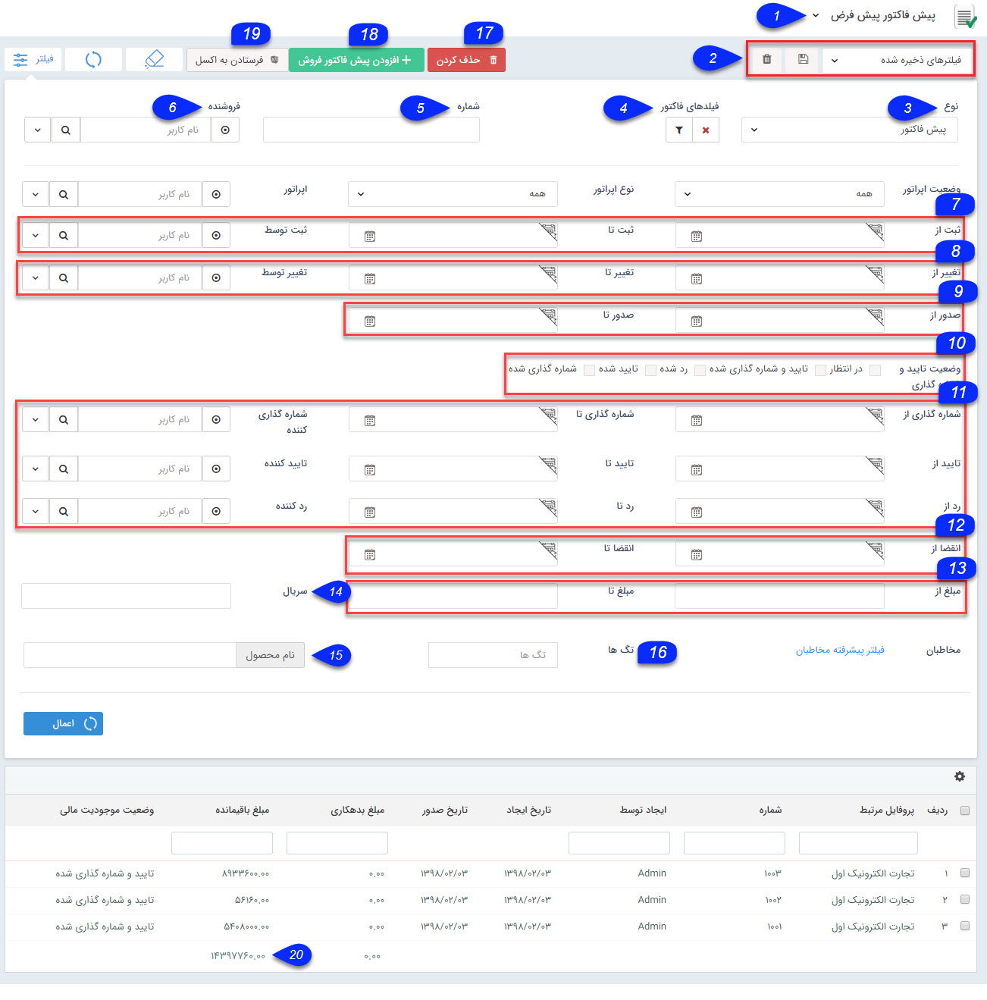

# پیش فاکتور/فاکتور/فاکتور برگشتی    

**پیش فاکتور/فاکتور/فاکتور برگشتی**

لیست تمام پیش فاکتور/فاکتور/ فاکتور برگشتی های ثبت شده در نرم افزار نمایش داده می شود و می توان اطلاعات جزئی هر کدام از آن ها را نیز مشاهده نمود. علاوه بر این می توانید سوابق جدیدی در این قسمت ایجاد کنید و یا سوابق موجود را ویرایش یا حذف کنید.

نکته:هر کاربر می تواند تنها سوابقی (پیش فاکتور/فاکتور/فاکتور برگشتی) که خود ثبت نموده است مشاهده نماید و تنها کاربر دارای مجوز "مشاهده لیست سابقه (پیش فاکتور یا فاکتور یا فاکتور برگشتی) می تواند کلیه سوابق (پیش فاکتور یا فاکتور یا فاکتور برگشتی) ثبت شده توسط سایر کاربران سیستم را مشاهده نماید.

 

نکته: لطفا ابتدا قسمت  [فیلترهای پیشرفته](../PayamGostarSyncBank/JobsForFirst/Background/AdvancedFilters.md) را مطالعه کنید.

1\. **زیرنوع آیتم:** زیرنوع فاکتورها و پیش فاکتورها از این قسمت قابل تغییر است.

2.**نوع فیلتر:** میتوانید فیلترهای اعمال شده را به عنوان یک فیلتر اختصاصی خود ذخیره کنید.

3\. **نوع:** نوع آیتم در این قسمت نمایش داده می شود

4. **فیلدهای فاکتور :**می توانید با استفاده از دکمه فیلتر موجود در این فیلد، روی فیلدهای اضافه شده نیز فیلتر مورد نظر خود را اعمال کنید.

5\. **شماره:** می توانید در این قسمت، شماره یا بخشی از شماره سابقه (پیش فاکتور/فاکتور/فاکتور برگشتی) یا سوابق مورد نظر خود را وارد کنید.

6\. **فروشنده:** می توانید صادر کننده (فروشنده) ثبت شده در فاکتور/پیش فاکتور را جستجو کنید.

7\. **فیلدهای ثبت:** می توانید بازه ایجاد سابقه (پیش فاکتور/فاکتور/فاکتور برگشتی)  و کاربر ایجاد کننده آن را تعیین کنید.

8\. **فیلدهای ویرایش:** می توانید بازه ویرایش سابقه (پیش فاکتور/فاکتور/فاکتور برگشتی) و کاربر ویرایش کننده آن را تعیین کنید.

9\. **فیلدهای صدور:** می توانید بازه زمانی صدور سابقه (پیش فاکتور/فاکتور/فاکتور برگشتی) و کاربر صادر کننده (فروشنده) را تعیین کنید.

10.**وضعیت تایید و شماره گذاری:** می توانید وضعیت تایید و شماره گذاری سوابق مورد نظر (در انتظار، تایید شده، شماره گذاری شده، تایید و شماره گذاری شده، رد شده) را انتخاب کنید.

11\. **فیلدهای تایید،شماره گذاری و رد:** می توانید بازه زمانی تایید،شماره گذاری یا رد سابقه (پیش فاکتور/فاکتور/فاکتور برگشتی) و کاربر تایید کننده،شماره گذاری کننده و رد کننده را تعیین کنید.

12\. **فیلدهای انقضا:** می توانید بازه زمانی انقضای پیش فاکتور را تعیین کنید.

13.**حدود مبلغ:** می توانید حداقل و حداکثر مبلغ سابقه (پیش فاکتور/فاکتور/فاکتور برگشتی) مورد نظر خود را درج کنید.

14\. **سریال:** می توانید سریال کالای وارد شده را درج نمایید تا تنهای سابقه (پیش فاکتور/فاکتور/فاکتور برگشتی) دارای آن سریال فیلتر گردد.

15.  **نام محصول:** می توانید بر اساس نام محصول فیلتری را تعیین کنید تا سوابق (پیش فاکتور/فاکتور/فاکتور برگشتی) دارای آن را فیلتر کنید. همچنین با کلیک بر روی نام محصول می توانید از بین گروه محصولات و محصولات تعریف شده در قسمت [مدیریت محصولات](BaseInformatio\ProduceManagement.md) ، محصول مورد نظر خود را برای جستجو انتخاب کنید.

16. **تگ ها:** می توانید قراردادها را بر اساس تگی که روی آن ها گذاشته اید جستجو کنید.

17. **حذف کردن:** می توانید سابقه یا سوابق انتخاب شده را حذف کنید.

18\. **اضافه کردن:** می توانید بک سابقه جدید ایجاد کنید.

19.**فرستادن به اکسل:** می توانید سوابق فیلتر شده را در قالب فایل اکسل دریافت نمایید.

20\. **مبلغ نهایی:** با استفاده از این ستون مجموع مبلغ سوابق فیلتر شده قابل مشاهده است.